---
## Front matter
lang: ru-RU
title: Презентация к лабораторной работе  4
subtitle: Простейший шаблон
author:
  - Ду нашсименту Висенте Феликс.
institute:
  - Российский университет дружбы народов, Москва, Россия
  - Факультет физико-математических и естественных наук, Москва, Россия
date: 28 февраля 2023

## i18n babel
babel-lang: russian
babel-otherlangs: english

## Formatting pdf
toc: false
toc-title: Содержание
slide_level: 2
aspectratio: 169
section-titles: true
theme: metropolis
header-includes:
 - \metroset{progressbar=frametitle,sectionpage=progressbar,numbering=fraction}
 - '\makeatletter'
 - '\beamer@ignorenonframefalse'
 - '\makeatother'
---

# Информация

## Докладчик

:::::::::::::: {.columns align=center}
::: {.column width="70%"}

  * Ду нашсименту Висенте Феликс
  * Студент 3-го курса
  * Группа НКНбд-01-20
  * Российский университет дружбы народов
  * 1032199092
  * <https://github.com/kpatocfelix>

# Вводная часть

## Актуальность

Техника и окружающий мир являются примерами того, что существуют такие процессы, которые повторяются через определенные промежутки времени, то есть периодически. Их называют колебательными.

Гармонические колебания — колебания, при которых физическая величина изменяется с течением времени по гармоническому (синусоидальному, косинусоидальному) закону.

- Чтобы перейти к гармоническим колебаниям, нам нужно описать величины, которые помогут нам эти колебания охарактеризовать. Любое колебательное движение можно описать величинами: период, частота, амплитуда, фаза колебаний. 

Колебания делятся на два вида: свободные и вынужденные:
- Свободные колебания-Это колебания, которые происходят под действием внутренних сил в колебательной системе.

- Вынужденные колебания-это колебания, которые происходят под действием внешней периодически меняющейся силы. 

- Как установил в 1822 году Фурье, широкий класс периодических функций может быть разложен на сумму тригонометрических компонентов — в ряд Фурье. Другими словами, любое периодическое колебание может быть представлено как сумма гармонических колебаний с соответствующими амплитудами, частотами и начальными фазами. Среди слагаемых этой суммы существует гармоническое колебание с наименьшей частотой, которая называется основной частотой, а само это колебание — первой гармоникой или основным тоном, частоты же всех остальных слагаемых, гармонических колебаний, кратны основной частоте, и эти колебания называются высшими гармониками или обертонами — первым, вторым и т.д.

- Для широкого класса систем откликом на гармоническое воздействие является гармоническое колебание (свойство линейности), при этом связь воздействия и отклика является устойчивой характеристикой системы. С учётом предыдущего свойства это позволяет исследовать прохождение колебаний произвольной формы через системы.

## Объект и предмет исследования

-	Модель гармонических колебаний
-	Язык программирования Julia
-	Система моделирования Openmodelica

## Цели и задачи
   
- Научиться работать с OpenModelica

- Построить фазовый портрет гармонического осциллятора

- Решить уравнения гармонического осциллятора

- Получение новых знаний в ходе выполнения лабораторной работы

   ## Задачи

 Вариант № 23
Постройте фазовый портрет гармонического осциллятора и решение уравнения гармонического осциллятора для следующих случаев

1. Колебания гармонического осциллятора без затуханий и без действий внешней силы $\ddot{x}+1.5=0$
2. Колебания гармонического осциллятора c затуханием и без действий внешней силы $\ddot{x}+0.8\dot{x}+3x=0$
3. Колебания гармонического осциллятора c затуханием и под действием внешней силы $\ddot{x}+3.3\dot{x}+0.1x=0.1sin(3t)$ На интервале t $\in{[0,46]}$(шаг 0.05) с начальными условиями x~0~=0.1, y~0~ = -1.1

## Материалы и методы
-	Язык программирования Julia
-	Пакеты “Plots”, "DifferentialEquations

## Содержание исследования

- Использование julia и Openmodelica для выполнения лабораторных работ

- Решение уравнения гармонического осциллятора

- Описание код 

-	Создание markdown отчета

-	Конвертация в pdf и docx посредствам Makefile

-	фиксация результатов в репозитории GitHub.

## Результаты

- Мы научились работать в OpenModelica

- Научились решать уравнения гармонического осциллятора

- Научились строить фазовые портреты
1).
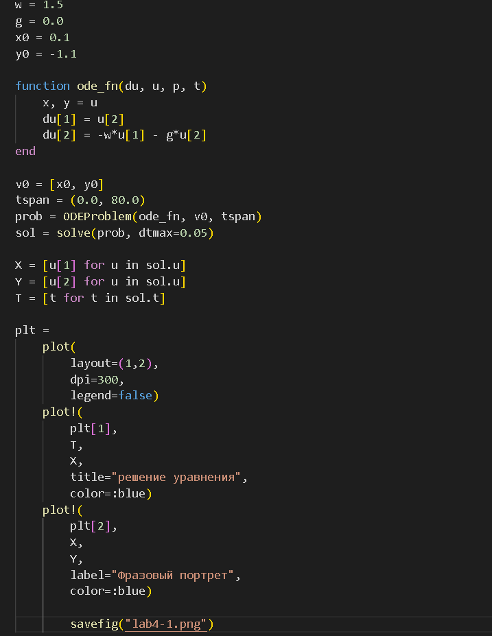
Julia упр.1

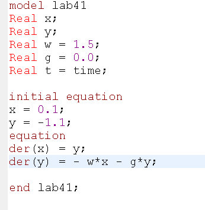
Open modelica упр.1

2).
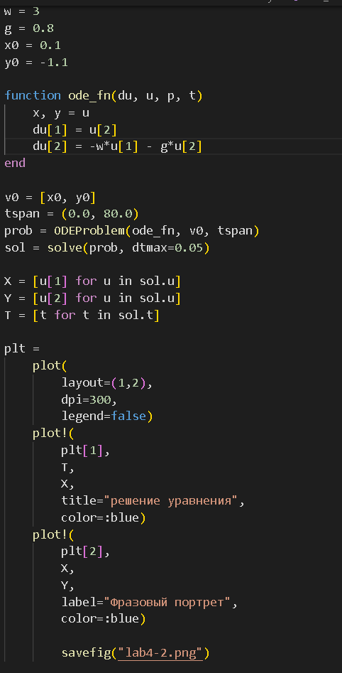
Julia упр.2

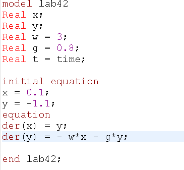
Open modelica упр.2

3).
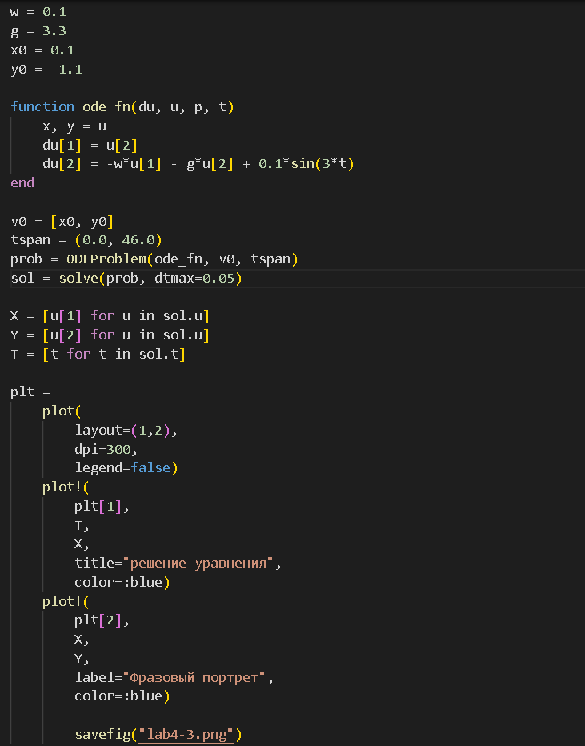
Julia упр.3

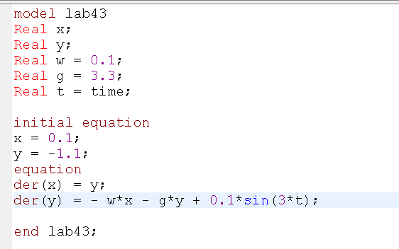
Open modelica упр.3

## Выводы

### 1.1)

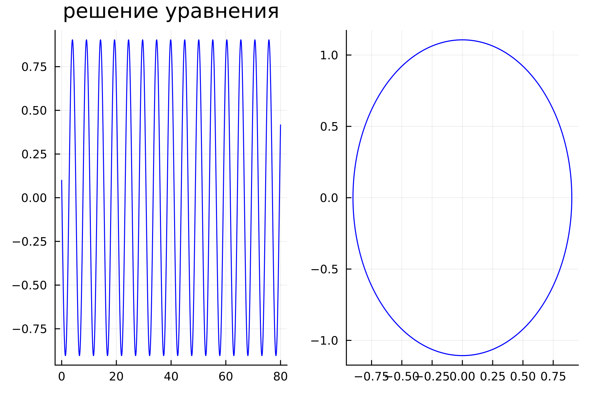
Выводы julia упр.1

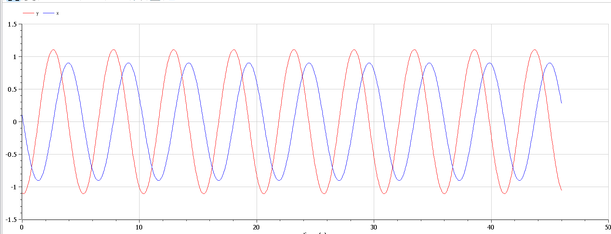
Выводы Open modelica упр.1

### 2.1)

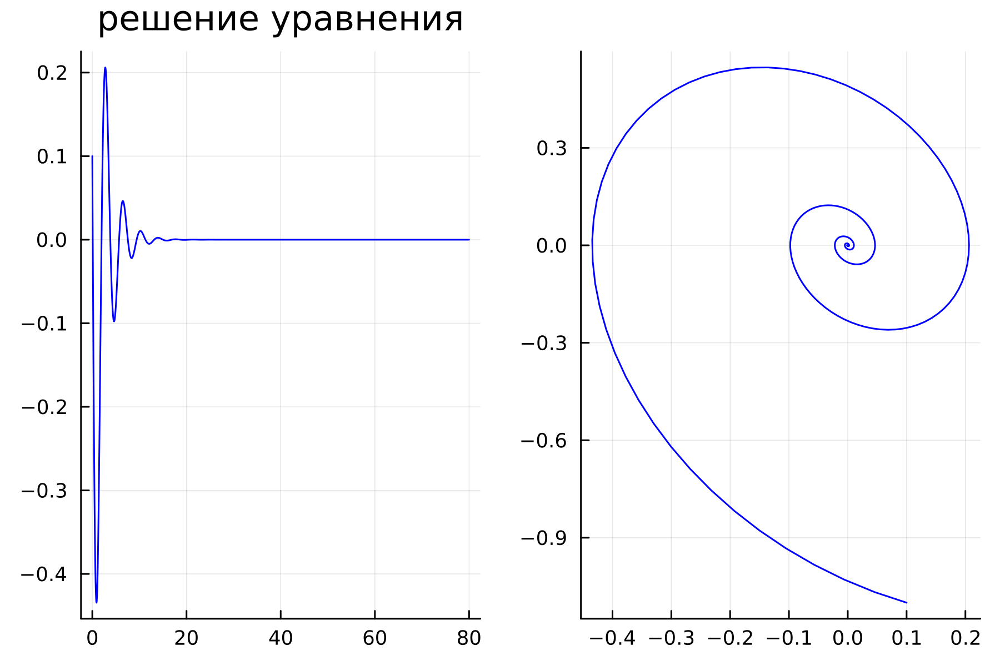
Выводы julia упр.1

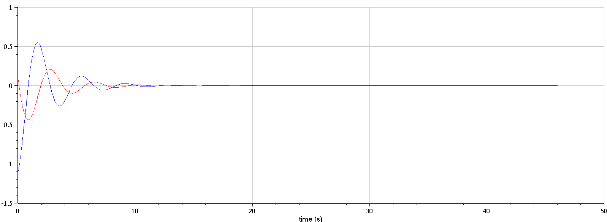
Выводы Open modelica упр.2

### 3.1)

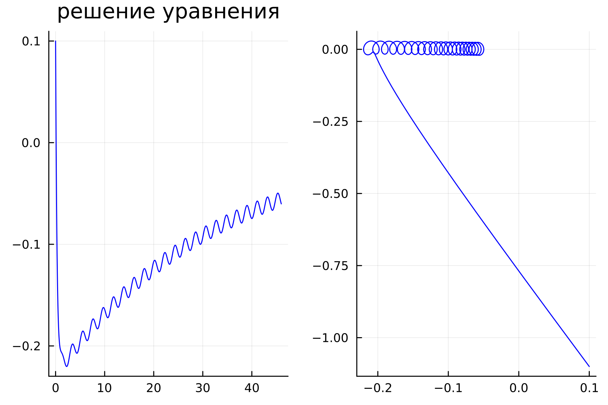
Выводы julia упр.3

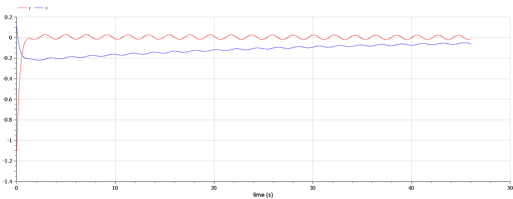
Выводы Open modelica упр.3

## Итоговый слайд

- СПАСИБО ЗА ВИНИМАНИЕ
