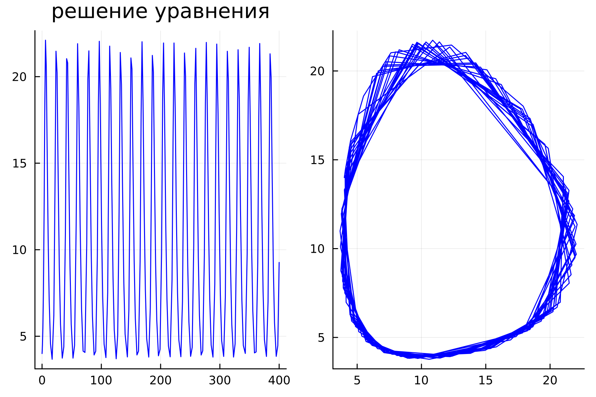
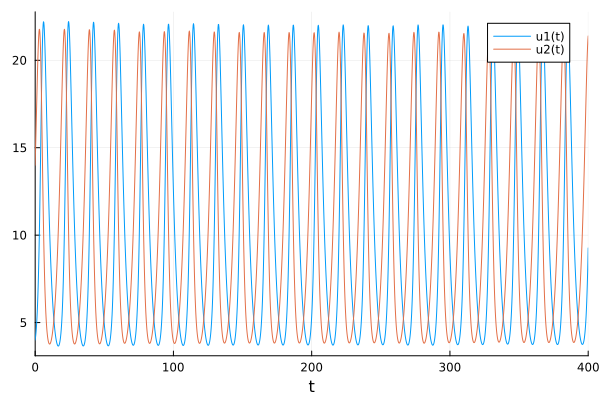

---
## Front matter
lang: ru-RU
title: Презентация к лабораторной работе  5
subtitle: Простейший шаблон
author:
  - Ду нашсименту Висенте Феликс.
institute:
  - Российский университет дружбы народов, Москва, Россия
  - Факультет физико-математических и естественных наук, Москва, Россия
date: 28 февраля 2023

## i18n babel
babel-lang: russian
babel-otherlangs: english

## Formatting pdf
toc: false
toc-title: Содержание
slide_level: 2
aspectratio: 169
section-titles: true
theme: metropolis
header-includes:
 - \metroset{progressbar=frametitle,sectionpage=progressbar,numbering=fraction}
 - '\makeatletter'
 - '\beamer@ignorenonframefalse'
 - '\makeatother'
---

# Информация

## Докладчик

:::::::::::::: {.columns align=center}
::: {.column width="70%"}

  * Ду нашсименту Висенте Феликс
  * Студент 3-го курса
  * Группа НКНбд-01-20
  * Российский университет дружбы народов
  * 1032199092
  * <https://github.com/kpatocfelix>


# Вводная часть

## Актуальность

Модель хищник-жертва – это особая взаимосвязь хищника с жертвой, в результате которой выигрывают оба. Выживают наиболее здоровые и приспособленные особи к условиям среды обитания, т.е. все это происходит благодаря естественному отбору. В той среде где нет возможности для размножения.
Модель Лотки-Вольтерры — модель взаимодействия двух видов типа «хищник — жертва», названная в честь её авторов, которые предложили модельные уравнения независимо друг от друга. Такие уравнения можно использовать для моделирования систем «хищник — жертва», «паразит — хозяин», конкуренции и других видов взаимодействия между двумя видами.

## Цели и задачи

- Научиться работать с OpenModelica и julia

- Построить график зависимости численности хищников от численности жертв

- Построить графики изменения численности хищников и численности жертв при заданных начальных условиях

- Найти стационарное состояние системы

## Задачи

Вариант № 23

$$
\begin{cases}
  \frac{dx}{dt}=-0.38x(t)+0.037x(t)y(t)
  \\
  \frac{dy}{dt}=0.36x(t) - 0.035x(t)y(t)
\end{cases}
$$

Постройте график зависимости численности хищников от численности жертв, а также графики изменения численности хищников и численности жертв при следующих начальных условиях: x~0~=4, y~0~=14. Найдите стационарное состояние системы.

## Объект и предмет исследования

-	Модель гармонических колебаний
-	Язык программирования Julia
-	Система моделирования Openmodelica

## задания
1. julia

```
1.1
using Plots
using DifferentialEquations

a = 0.38
b = 0.36
c = 0.037
d = 0.035

x0 = 4
y0 = 14


function F(du, u, p, t)
    x, y = u
    du[1] = -a*u[1] + c*u[1]*u[2]
    du[2] = b*u[2] - d*u[1]*u[2]
end
v0 = [x0, y0]
tspan = (0.0, 400.0)

prob = ODEProblem(F,v0,tspan)
sol = solve(prob)
X = [u[1] for u in sol.u]
Y = [u[2] for u in sol.u]
T = [t for t in sol.t]


plt = 
    plot(
        layout=(1,2),
        dpi=300,
        legend=false)
    plot!(
        plt[1],
        T,
        X,
        title="решение уравнения",
        color=:blue)
    plot!(
        plt[2],
        X,
        Y,
        label="Фразовый портрет",
        color=:blue)

savefig("lab5-1.png")
```

```
1.2
using Plots
using DifferentialEquations

a = 0.38
b = 0.36
c = 0.037
d = 0.035

x0 = 4
y0 = 14


function F(du, u, p, t)
    x, y = u
    du[1] = -a*u[1] + c*u[1]*u[2]
    du[2] = b*u[2] - d*u[1]*u[2]
end
v0 = [x0, y0]
tspan = (0.0, 400.0)

prob = ODEProblem(F,v0,tspan)
sol = solve(prob)
X = [u[1] for u in sol.u]
Y = [u[2] for u in sol.u]
T = [t for t in sol.t]

plot(sol)

savefig("lab5-2.png")
```

2.OMEDIt
````
model lab51
parameter Real a = 0.38;
parameter Real b = 0.36;
parameter Real c = 0.037;
parameter Real d = 0.035;

parameter Real x0 = 4;
parameter Real y0 = 14;


Real x(start = x0);
Real y(start = y0);
  

equation

der(x) = -a*x + c*x*y;
der(y) = b*x - d*x*y;
  annotation(experiment(StartTime = 0, StopTime = 400, Tolerance = 1e-6,Interval = 0.1));
end lab51;
````

В этой модели x – число жертв, y - число хищников. Коэффициент a
описывает скорость естественного прироста числа жертв в отсутствие хищников, с естественное вымирание хищников, лишенных пищи в виде жертв.
Вероятность взаимодействия жертвы и хищника считается пропорциональной как количеству жертв, так и числу самих хищников (xy).
Каждый акт взаимодействия уменьшает популяцию жертв, но способствует увеличению популяции хищников (члены -bxy и dxy в правой части уравнения).


## Итоговый слайд

- СПАСИБО ЗА ВИНИМАНИЕ
