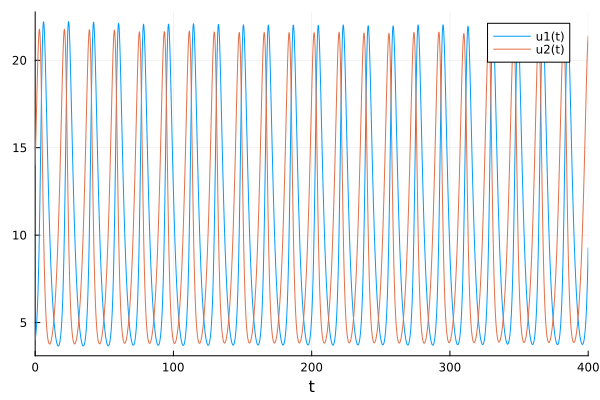

---
## Front matter
title: "Отчёт по лабораторной работе 5"
subtitle: "Простейший вариант 23"
author: "Ду нашсименту Висенте Феликс"

## Generic otions
lang: ru-RU
toc-title: "Содержание"

## Bibliography
bibliography: bib/cite.bib
csl: pandoc/csl/gost-r-7-0-5-2008-numeric.csl

## Pdf output format
toc: true # Table of contents
toc-depth: 2
lof: true # List of figures
lot: true # List of tables
fontsize: 12pt
linestretch: 1.5
papersize: a4
documentclass: scrreprt
## I18n polyglossia
polyglossia-lang:
  name: russian
  options:
	
	- babelshorthands=true
polyglossia-otherlangs:
  name: english
## I18n babel
babel-lang: russian
babel-otherlangs: english
## Fonts
mainfont: PT Serif
romanfont: PT Serif
sansfont: PT Sans
monofont: PT Mono
mainfontoptions: Ligatures=TeX
romanfontoptions: Ligatures=TeX
sansfontoptions: Ligatures=TeX,Scale=MatchLowercase
monofontoptions: Scale=MatchLowercase,Scale=0.9
## Biblatex
biblatex: true
biblio-style: "gost-numeric"
biblatexoptions:
  - parentracker=true
  - backend=biber
  - hyperref=auto
  - language=auto
  - autolang=other*
  - citestyle=gost-numeric
## Pandoc-crossref LaTeX customization
figureTitle: "Рис."
tableTitle: "Таблица"
listingTitle: "Листинг"
lofTitle: "Список иллюстраций"
lotTitle: "Список таблиц"
lolTitle: "Листинги"
## Misc options
indent: true
header-includes:
  - \usepackage{indentfirst}
  - \usepackage{float} # keep figures where there are in the text
  - \floatplacement{figure}{H} # keep figures where there are in the text
---

## Цель работы

 Pешаем задачу Для модели «хищник-жертва»:.

## Задание

Формула определения номера задания: (SnmodN)+1, где Sn — номер студбилета, N — количество заданий.

Вариант № 23

$$
\begin{cases}
  \frac{dx}{dt}=-0.38x(t)+0.037x(t)y(t)
  \\
  \frac{dy}{dt}=0.36x(t) - 0.035x(t)y(t)
\end{cases}
$$

Постройте график зависимости численности хищников от численности жертв, а также графики изменения численности хищников и численности жертв при следующих начальных условиях: x~0~=4, y~0~=14. Найдите стационарное состояние системы.

## Теоретическое введение

Простейшая модель взаимодействия двух видов типа «хищник — жертва» -
модель Лотки-Вольтерры. Данная двувидовая модель основывается на следующих предположениях:

1. Численность популяции жертв x и хищников y зависят только от времени (модель не учитывает пространственное распределение популяции на занимаемой территории).
2. В отсутствии взаимодействия численность видов изменяется по модели Мальтуса, при этом число жертв увеличивается, а число хищников падает.
3. Естественная смертность жертвы и естественная рождаемость хищника считаются несущественными
4. Эффект насыщения численности обеих популяций не учитывается
5. Скорость роста численности жертв уменьшается пропорционально численности хищников
a = 0.38
b = 0.36
c = 0.037
d = 0.035
$$
\begin{cases}
  \frac{dx}{dy}=-ax(t)+cx(t)y(t)
  \\
  \frac{dx}{dy}=bx(t)+dx(t)y(t)
\end{cases}
$$
В этой модели x – число жертв, y - число хищников. Коэффициент a
описывает скорость естественного прироста числа жертв в отсутствие хищников, с- естественное вымирание хищников, лишенных пищи в виде жертв. Вероятность взаимодействия жертвы и хищника считается пропорциональной как количеству жертв, так и числу самих хищников (xy). Каждый акт взаимодействия уменьшает популяцию жертв, но способствует увеличению популяции хищников (члены -bxy и dxy в правой части уравнения).


Рисунок 3.1. Эволюция популяции жертв и хищников в модели Лотки-Вольтерры.

Математический анализ этой (жесткой) модели показывает, что имеется стационарное состояние (A на рис.1), всякое же другое начальное состояние (B) приводит к периодическому колебанию численности как жертв, так и хищников, так что по прошествии некоторого времени система возвращается в состояние B.
Стационарное состояние системы (положение равновесия, не зависящее от времени решение) будет в точке: x~0~$=\frac{c}{d}$, x~0~$=\frac{a}{b}$. Если начальные значения задать в стационарном состоянии x(0)=x~0~,y(0)=y~0~ то в любой момент времени численность популяций изменяться не будет. При малом отклонении от положения равновесия численности как хищника, так и жертвы с течением времени не возвращаются к равновесным значениям, а совершают периодические колебания вокруг стационарной точки. Амплитуда колебаний и их период определяется начальными значениями численностей x(0), y(0). Колебания совершаются в противофазе.
При малом изменении модели

$$
\begin{cases}
  \frac{dx}{dy}=-ax(t)+cx(t)y(t)+\varepsilon f(x,y)
  \\
  \frac{dx}{dy}=bx(t)+dx(t)y(t)+\varepsilon g(x,y), \varepsilon<<1
\end{cases}
$$
(прибавление к правым частям малые члены, учитывающие, например, конкуренцию жертв за пищу и хищников за жертв), вывод о периодичности (возвращении системы в исходное состояние B), справедливый для жесткой системы Лотки-Вольтерры, теряет силу. Таким образом, мы получаем так называемую мягкую модель «хищник-жертва». В зависимости от вида малых поправок f и g возможны следующие сценарии 1-3 рис. 2.


$$Рисунок 2. Мягкая модель борьбы за существование.$$

В случае 1 равновесное состояние A устойчиво. При любых других
начальных условиях через большое время устанавливается именно оно.
В случае 2 система стационарное состояние неустойчиво.
Эволюция приводит то к резкому увеличению числа хищников, то к их почти полному вымиранию. Такая система в конце концов попадает в область столь больших или столь малых значений x и y, что модель перестает быть применимой.
В случае 3 в системе с неустойчивым стационарным состоянием A с течением времени устанавливается периодический режим. В отличие от исходной жесткой модели Лотки-Вольтерры, в этой модели установившийся периодический режим не зависит от начального условия.
Первоначально незначительное отклонение от стационарного состояния A приводит не к малым колебаниям около A, как в модели Лотки-Вольтерры, а к колебаниям вполне определенной (и не зависящей от малости отклонения) амплитуды.
Возможны и другие структурно устойчивые сценарии (например, с несколькими периодическими режимами).
Вывод: жесткую модель всегда надлежит исследовать на структурную устойчивость полученных при ее изучении результатов по отношению к малым изменениям модели (делающим ее мягкой).
В случае модели Лотки-Вольтерры для суждения о том, какой же из
сценариев 1-3 (или иных возможных) реализуется в данной системе, совершенно необходима дополнительная информация о системе (о виде малых поправок f и g в нашей формуле). Математическая теория мягких моделей указывает, какую именно информацию для этого нужно иметь.
Без этой информации жесткая модель может привести к качественно ошибочным предсказаниям. Доверять выводам, сделанным на основании жесткой модели, можно лишь тогда, когда они подтверждаются исследованием их структурной устойчивости

## Выполнение лабораторной работы

1. julia

```
1.1
using Plots
using DifferentialEquations

a = 0.38
b = 0.36
c = 0.037
d = 0.035

x0 = 4
y0 = 14


function F(du, u, p, t)
    x, y = u
    du[1] = -a*u[1] + c*u[1]*u[2]
    du[2] = b*u[2] - d*u[1]*u[2]
end
v0 = [x0, y0]
tspan = (0.0, 400.0)

prob = ODEProblem(F,v0,tspan)
sol = solve(prob)
X = [u[1] for u in sol.u]
Y = [u[2] for u in sol.u]
T = [t for t in sol.t]


plt = 
    plot(
        layout=(1,2),
        dpi=300,
        legend=false)
    plot!(
        plt[1],
        T,
        X,
        title="решение уравнения",
        color=:blue)
    plot!(
        plt[2],
        X,
        Y,
        label="Фразовый портрет",
        color=:blue)

savefig("lab5-1.png")
```

```
1.2
using Plots
using DifferentialEquations

a = 0.38
b = 0.36
c = 0.037
d = 0.035

x0 = 4
y0 = 14


function F(du, u, p, t)
    x, y = u
    du[1] = -a*u[1] + c*u[1]*u[2]
    du[2] = b*u[2] - d*u[1]*u[2]
end
v0 = [x0, y0]
tspan = (0.0, 400.0)

prob = ODEProblem(F,v0,tspan)
sol = solve(prob)
X = [u[1] for u in sol.u]
Y = [u[2] for u in sol.u]
T = [t for t in sol.t]

plot(sol)

savefig("lab5-2.png")
```

2.OMEDIt
````
model lab51
parameter Real a = 0.38;
parameter Real b = 0.36;
parameter Real c = 0.037;
parameter Real d = 0.035;

parameter Real x0 = 4;
parameter Real y0 = 14;


Real x(start = x0);
Real y(start = y0);
  

equation

der(x) = -a*x + c*x*y;
der(y) = b*x - d*x*y;
  annotation(experiment(StartTime = 0, StopTime = 400, Tolerance = 1e-6,Interval = 0.1));
end lab51;
````

