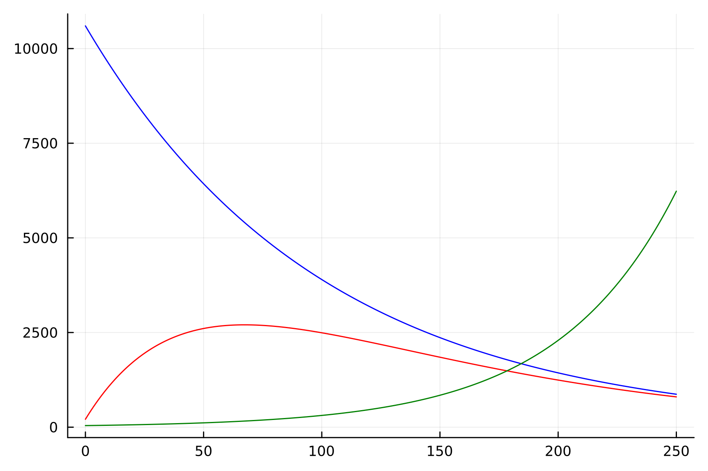
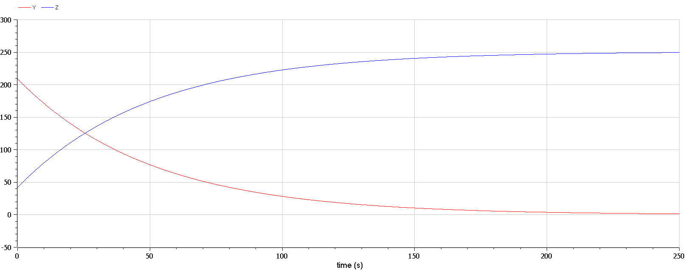
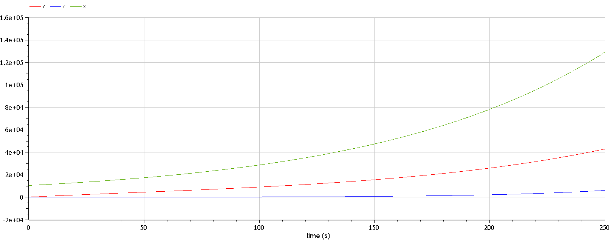

---
## Front matter
lang: ru-RU
title: Презентация к лабораторной работе  6
subtitle: Простейший шаблон
author:
  - Ду нашсименту Висенте Феликс.
institute:
  - Российский университет дружбы народов, Москва, Россия
  - Факультет физико-математических и естественных наук, Москва, Россия
date: 28 февраля 2023

## i18n babel
babel-lang: russian
babel-otherlangs: english

## Formatting pdf
toc: false
toc-title: Содержание
slide_level: 2
aspectratio: 169
section-titles: true
theme: metropolis
header-includes:
 - \metroset{progressbar=frametitle,sectionpage=progressbar,numbering=fraction}
 - '\makeatletter'
 - '\beamer@ignorenonframefalse'
 - '\makeatother'
---

# Информация

## Докладчик

:::::::::::::: {.columns align=center}
::: {.column width="70%"}

  * Ду нашсименту Висенте Феликс
  * Студент 3-го курса
  * Группа НКНбд-01-20
  * Российский университет дружбы народов
  * 1032199092
  * <https://github.com/kpatocfelix>


# Вводная часть

## Актуальность

Эпидемия – это распространение среди людей инфекционных болезней, существенно превышающее уровень заболеваемости, который обычно регистрируется на конкретной территории (эпидемиологический порог).

Универсальным уровнем заболеваемости, за которым начинается эпидемия, считается инфицирование 5 % населения или какой-либо группы. Медики могут рассчитывать эпидемические пороги, беря за основу средний уровень заболеваемости по конкретному неблагополучию в течение многих лет – они могут составлять 1% или 2%.
Эпидемическое бедствие быстро прогрессирует, поражая все большее число людей. Оно затягивается по времени и переходит на новые пространства, а значит может стать причиной чрезвычайной ситуации, если зайдет слишком далеко.

Изучению всех тонкостей массовых вспышек заболеваемости посвящен самостоятельный раздел медицины – эпидемиология.


## Цели и задачи

- Научиться работать с OpenModelica и julia

- Рассмотрим простейшую модель эпидемии

- Построить графики изменения модель эпидемии при заданных начальных условиях

- Найти стационарное состояние системы

## Задачи

Вариант № 23

На одном острове вспыхнула эпидемия. Известно, что из всех проживающих на острове (N=10 850) в момент начала эпидемии (t=0) число заболевших людей (являющихся распространителями инфекции) I(0)=209, А число здоровых людей с иммунитетом к болезни R(0)=42. Таким образом, число людей восприимчивых к болезни, но пока здоровых, в начальный момент времени S(0)=N-I(0)- R(0).
Постройте графики изменения числа особей в каждой из трех групп.
Рассмотрите, как будет протекать эпидемия в случае:
  
  1) если $I(0) \leq I^*$
  
  2) если $I(0) > I^*$

## Объект и предмет исследования

-	модель эпидемии
-	Язык программирования Julia
-	Система моделирования Openmodelica

## задания
1. julia

```
1.1
using Plots
using DifferentialEquations

a= 0.01
b= 0.02

N = 10850
y0 =209
z0 = 42
x0 =  N - y0 - z0

function ode_fn(du, u, p, t)
    x, y, z = u
    du[1] = 0
    du[2] = - b*u[2]
    du[3] = b*u[3]
end

u0 = [x0, y0, z0]
tspan = (0.0, 200.0)
prob = ODEProblem(ode_fn, u0, tspan)
sol = solve(prob, dtmax=0.01)

X = [u[1] for u in sol.u]
Y = [u[2] for u in sol.u]
Z = [u[3] for u in sol.u]
T = [t for t in sol.t]

plt =
    plot(
        layout=(1,2),
        dpi=300,
        legend=false)
    plot!(
        plt[1],
        T,
        X,
        label="решение уравнения S",
        color=:blue)
    plot!(
        plt[2],
        T,
        Y,
        label="решение уравнения I",
        color=:red)
    plot!(
        plt[2],
        T,
        Z,
        label="решение уравнения R",
        color=:green)

savefig("lab6_1.png")
```

```
1.2
using Plots
using DifferentialEquations

a= 0.01
b= 0.02

N = 10850
y0 =209
z0 = 42
x0 =  N - y0 - z0

function ode_fn(du, u, p, t)
    x, y, z = u
    du[1] = -a*u[1]
    du[2] = a*u[1] - b*u[2]
    du[3] = b*u[3]
end

u0 = [x0, y0, z0]
tspan = (0.0, 250.0)
prob = ODEProblem(ode_fn, u0, tspan)
sol = solve(prob, dtmax=0.01)

X = [u[1] for u in sol.u]
Y = [u[2] for u in sol.u]
Z = [u[3] for u in sol.u]
T = [t for t in sol.t]

plt =
    plot(
        layout=(1),
        dpi=300,
        legend=false)
    plot!(
        plt[1],
        T,
        X,
        label="решение уравнения S",
        color=:blue)
    plot!(
        plt[1],
        T,
        Y,
        label="решение уравнения I",
        color=:red)
    plot!(
        plt[1],
        T,
        Z,
        label="решение уравнения R",
        color=:green)

savefig("lab6_2.png")
```

2.OMEDIt
2.2)
````
model lab61
parameter Real a= 0.01;
parameter Real b= 0.02;

parameter Real N = 10850;
parameter Real y0 =209;
parameter Real z0 = 42;
parameter Real x0 =  N - y0 - z0;

Real X(start=x0);
Real Y(start=y0);
Real Z(start=z0);

equation //I<=I*

der(X)= 0;
der(Y)= -b*Y;
der(Z)= b*Y;

annotation(experiment(StartTime = 0, StopTime = 250, Tolerance = 1e-6, Interval = 0.2));

end lab61;
````
```

2.2)
model lab62
parameter Real a= 0.01;
parameter Real b= 0.02;

parameter Real N = 10850;
parameter Real y0 =209;
parameter Real z0 = 42;
parameter Real x0 =  N - y0 - z0;

Real X(start=x0);
Real Y(start=y0);
Real Z(start=z0);

equation //I>I*

der(X)= a*X;
der(Y)= a*X - b*Y;
der(Z)= b*Z;

annotation(experiment(StartTime = 0, StopTime = 250, Tolerance = 1e-6, Interval = 0.2));

end lab62;
```


## Итоговый слайд

- СПАСИБО ЗА ВИНИМАНИЕ
