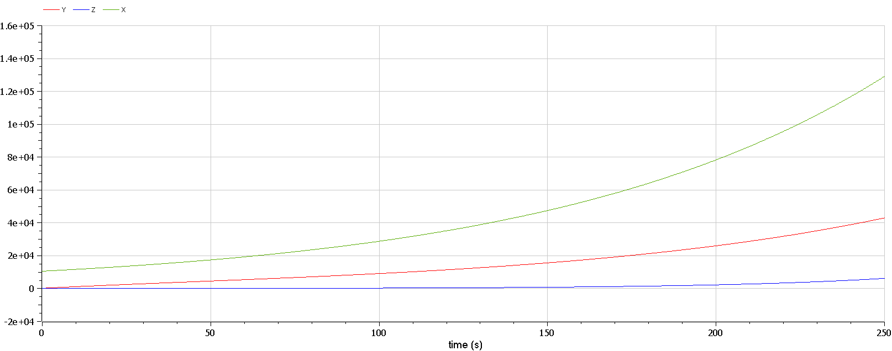

---
## Front matter
title: "Отчёт по лабораторной работе 6"
subtitle: "Простейший вариант 23"
author: "Ду нашсименту Висенте Феликс"

## Generic otions
lang: ru-RU
toc-title: "Содержание"

## Bibliography
bibliography: bib/cite.bib
csl: pandoc/csl/gost-r-7-0-5-2008-numeric.csl

## Pdf output format
toc: true # Table of contents
toc-depth: 2
lof: true # List of figures
lot: true # List of tables
fontsize: 12pt
linestretch: 1.5
papersize: a4
documentclass: scrreprt
## I18n polyglossia
polyglossia-lang:
  name: russian
  options:
	
	- babelshorthands=true
polyglossia-otherlangs:
  name: english
## I18n babel
babel-lang: russian
babel-otherlangs: english
## Fonts
mainfont: PT Serif
romanfont: PT Serif
sansfont: PT Sans
monofont: PT Mono
mainfontoptions: Ligatures=TeX
romanfontoptions: Ligatures=TeX
sansfontoptions: Ligatures=TeX,Scale=MatchLowercase
monofontoptions: Scale=MatchLowercase,Scale=0.9
## Biblatex
biblatex: true
biblio-style: "gost-numeric"
biblatexoptions:
  - parentracker=true
  - backend=biber
  - hyperref=auto
  - language=auto
  - autolang=other*
  - citestyle=gost-numeric
## Pandoc-crossref LaTeX customization
figureTitle: "Рис."
tableTitle: "Таблица"
listingTitle: "Листинг"
lofTitle: "Список иллюстраций"
lotTitle: "Список таблиц"
lolTitle: "Листинги"
## Misc options
indent: true
header-includes:
  - \usepackage{indentfirst}
  - \usepackage{float} # keep figures where there are in the text
  - \floatplacement{figure}{H} # keep figures where there are in the text
---

## Цель работы

 Pешаем Задача об эпидемии.

## Задание

Формула определения номера задания: (SnmodN)+1, где Sn — номер студбилета, N — количество заданий.

На одном острове вспыхнула эпидемия. Известно, что из всех проживающих на острове (N=10 850) в момент начала эпидемии (t=0) число заболевших людей (являющихся распространителями инфекции) I(0)=209, А число здоровых людей с иммунитетом к болезни R(0)=42. Таким образом, число людей восприимчивых к болезни, но пока здоровых, в начальный момент времени S(0)=N-I(0)- R(0).
Постройте графики изменения числа особей в каждой из трех групп.
Рассмотрите, как будет протекать эпидемия в случае:
  
  1) если $I(0) \leq I^*$
  
  2) если $I(0) > I^*$

## Теоретическое введение

Рассмотрим простейшую модель эпидемии. Предположим, что некая популяция, состоящая из N особей, (считаем, что популяция изолирована) подразделяется на три группы. Первая группа - это восприимчивые к болезни, но пока здоровые особи, обозначим их через S(t).
Вторая группа – это число инфицированных особей, которые также при этом являются распространителями инфекции, обозначим их I(t). А третья группа, обозначающаяся через R(t) – это здоровые особи с иммунитетом к болезни.
До того, как число заболевших не превышает критического значения I*,считаем, что все больные изолированы и не заражают здоровых. Когда $I(t)> I^* $,тогда инфицирование способны заражать восприимчивых к болезни особей.
Таким образом, скорость изменения числа S(t) меняется по следующему закону:

$$
\frac{dS}{dt}
\begin{cases}
  -\alpha S(t), если I(t) > I^*
  \\
  0, если I(t) \le I^*
\end{cases}
$$ 

Поскольку каждая восприимчивая к болезни особь, которая, в конце концов, заболевает, сама становится инфекционной, то скорость изменения числа инфекционных особей представляет разность за единицу времени между заразившимися и теми, кто уже болеет и лечится, т.е.:

$$
\frac{dI}{dt}
\begin{cases}
  \alpha S(t) - \beta I, если I(t) > I^*
  \\
 -\beta I , если I(t) \le I^*
\end{cases}
$$

А скорость изменения выздоравливающих особей (при этом приобретающие иммунитет к болезни)

$$ \frac{dR}{dt} = \beta I $$

Постоянные пропорциональности $\alpha , \beta $ - это коэффициенты заболеваемости и выздоровления соответственно.
Для того, чтобы решения соответствующих уравнений определялось
однозначно, необходимо задать начальные условия .
Считаем, что на начало эпидемии в момент времени $t = 0$ нет особей с иммунитетом к болезни $R(0)=0$, а число инфицированных и восприимчивых к болезни особей $I(0)$ и $S(0)$.
соответственно. Для анализа картины протекания эпидемии необходимо рассмотреть два случая:$I(0) \leq I^*, I(0) > I^*$.

## Выполнение лабораторной работы

1. julia

```
1.1
using Plots
using DifferentialEquations

a= 0.01
b= 0.02

N = 10850
y0 =209
z0 = 42
x0 =  N - y0 - z0

function ode_fn(du, u, p, t)
    x, y, z = u
    du[1] = 0
    du[2] = - b*u[2]
    du[3] = b*u[3]
end

u0 = [x0, y0, z0]
tspan = (0.0, 200.0)
prob = ODEProblem(ode_fn, u0, tspan)
sol = solve(prob, dtmax=0.01)

X = [u[1] for u in sol.u]
Y = [u[2] for u in sol.u]
Z = [u[3] for u in sol.u]
T = [t for t in sol.t]

plt =
    plot(
        layout=(1,2),
        dpi=300,
        legend=false)
    plot!(
        plt[1],
        T,
        X,
        label="решение уравнения S",
        color=:blue)
    plot!(
        plt[2],
        T,
        Y,
        label="решение уравнения I",
        color=:red)
    plot!(
        plt[2],
        T,
        Z,
        label="решение уравнения R",
        color=:green)

savefig("lab6_1.png")
```

```
1.2
using Plots
using DifferentialEquations

a= 0.01
b= 0.02

N = 10850
y0 =209
z0 = 42
x0 =  N - y0 - z0

function ode_fn(du, u, p, t)
    x, y, z = u
    du[1] = -a*u[1]
    du[2] = a*u[1] - b*u[2]
    du[3] = b*u[3]
end

u0 = [x0, y0, z0]
tspan = (0.0, 250.0)
prob = ODEProblem(ode_fn, u0, tspan)
sol = solve(prob, dtmax=0.01)

X = [u[1] for u in sol.u]
Y = [u[2] for u in sol.u]
Z = [u[3] for u in sol.u]
T = [t for t in sol.t]

plt =
    plot(
        layout=(1),
        dpi=300,
        legend=false)
    plot!(
        plt[1],
        T,
        X,
        label="решение уравнения S",
        color=:blue)
    plot!(
        plt[1],
        T,
        Y,
        label="решение уравнения I",
        color=:red)
    plot!(
        plt[1],
        T,
        Z,
        label="решение уравнения R",
        color=:green)

savefig("lab6_2.png")
```

2.OMEDIt
2.2)
````
model lab61
parameter Real a= 0.01;
parameter Real b= 0.02;

parameter Real N = 10850;
parameter Real y0 =209;
parameter Real z0 = 42;
parameter Real x0 =  N - y0 - z0;

Real X(start=x0);
Real Y(start=y0);
Real Z(start=z0);

equation //I<=I*

der(X)= 0;
der(Y)= -b*Y;
der(Z)= b*Y;

annotation(experiment(StartTime = 0, StopTime = 250, Tolerance = 1e-6, Interval = 0.2));

end lab61;
````
```

2.2)
model lab62
parameter Real a= 0.01;
parameter Real b= 0.02;

parameter Real N = 10850;
parameter Real y0 =209;
parameter Real z0 = 42;
parameter Real x0 =  N - y0 - z0;

Real X(start=x0);
Real Y(start=y0);
Real Z(start=z0);

equation //I>I*

der(X)= a*X;
der(Y)= a*X - b*Y;
der(Z)= b*Z;

annotation(experiment(StartTime = 0, StopTime = 250, Tolerance = 1e-6, Interval = 0.2));

end lab62;
```
