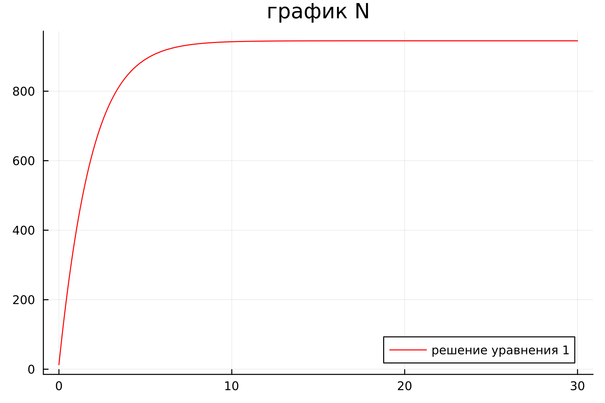
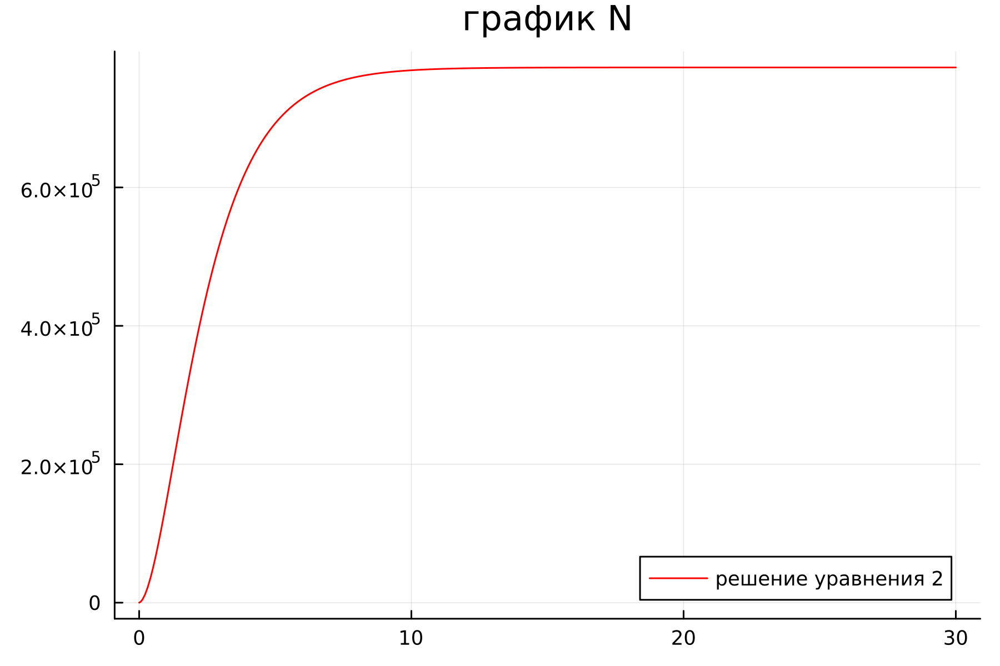
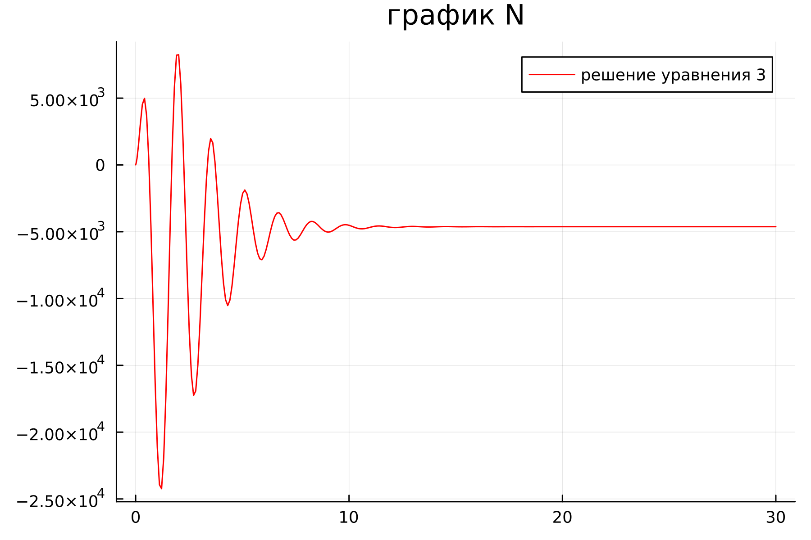
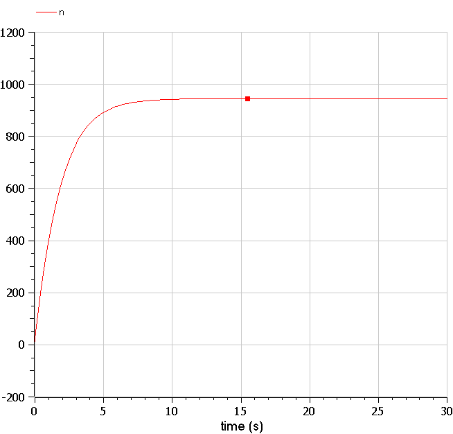
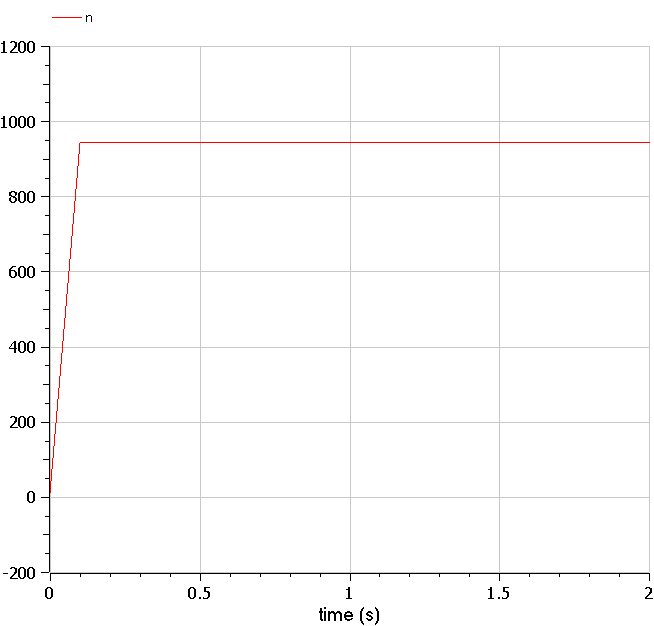
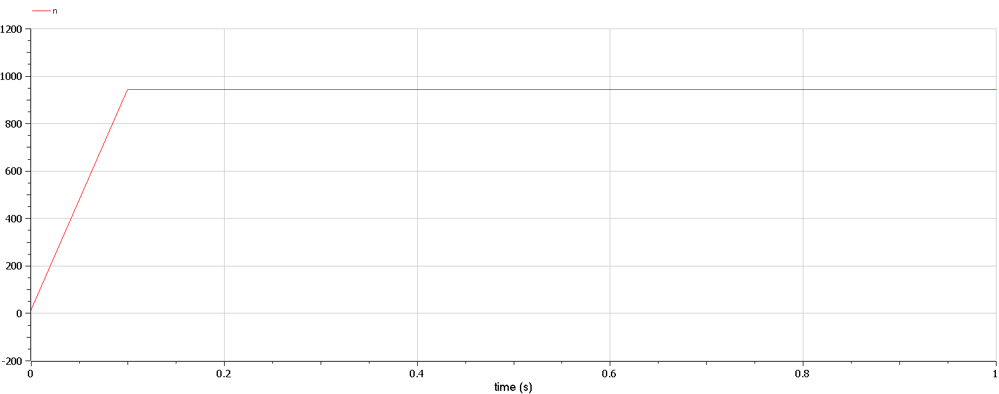

---
## Front matter
lang: ru-RU
title: Презентация к лабораторной работе  7
subtitle: Простейший шаблон
author:
  - Ду нашсименту Висенте Феликс.
institute:
  - Российский университет дружбы народов, Москва, Россия
  - Факультет физико-математических и естественных наук, Москва, Россия
date: 28 февраля 2023

## i18n babel
babel-lang: russian
babel-otherlangs: english

## Formatting pdf
toc: false
toc-title: Содержание
slide_level: 2
aspectratio: 169
section-titles: true
theme: metropolis
header-includes:
 - \metroset{progressbar=frametitle,sectionpage=progressbar,numbering=fraction}
 - '\makeatletter'
 - '\beamer@ignorenonframefalse'
 - '\makeatother'
---

# Информация

## Докладчик

:::::::::::::: {.columns align=center}
::: {.column width="70%"}

  * Ду нашсименту Висенте Феликс
  * Студент 3-го курса
  * Группа НКНбд-01-20
  * Российский университет дружбы народов
  * 1032199092
  * <https://github.com/kpatocfelix>


# Вводная часть

## Актуальность

Эффективность рекламы  — это то, в какой степени достигнуты поставленные перед рекламой цели при минимальных затратах

## Цели и задачи

- Научиться работать с OpenModelica и julia

- Рассмотрим простейшую модель Эффективность рекламы

- Построить графики изменения модель Эффективность рекламы при заданных начальных условиях

- Найти стационарное состояние системы

## Задачи

Вариант № 23
Постройте график распространения рекламы, математическая модель которой описывается следующим уравнением:

$$
\frac{dn}{dt}=
\begin{cases}
  (0.51 + 0.000099n(t))(N - n(t))
  \\
  (0.000019 + 0.99n(t))(N - n(t))
  \\
  (0.99t + 0.3cos(4t)n(t))(N - n(t))
\end{cases}
$$
При этом объем аудитории $N = 945$, в начальный момент о товаре знает 13 человек.
Для случая 2 определите в какой момент времени скорость распространения рекламы будет иметь максимальное значение.

## Объект и предмет исследования

-	Эффективность рекламы
-	Язык программирования Julia
-	Система моделирования Openmodelica

## задания

## 1. julia

```
1.1
using Plots
using DifferentialEquations

"коэффициент уравнения 1"
a1 = 0.51
a2 = 0.000099

"коэффициент уравнения 2"
b1 = 0.000019
b2 = 0.99

"коэффициент уравнения 3"
c1 = 0.99
c2 = 0.3
N = 945    
n0 = 13


function  odn_f(du, u, p, t)
    x, y, z = u
    du[1]= (a1+a2*u[1])*(N-u[1])                 
    du[2]= (b1+b2*u[1])*(N-u[1])                     
    du[3]= (c1*t+c2*cos(4*t)*u[1])*(N-u[1])           
end
u0 = [n0, n0, n0]
tspan =(0.0, 30.0)
prob1 = ODEProblem(odn_f, u0, tspan)
sol1 = solve(prob1, dtmax=0.1)

N1 = [u[1] for u in sol1.u]
N2 = [u[2] for u in sol1.u]
N3 = [u[3] for u in sol1.u]
T = [t for t in sol1.t]

plt = 
    plot(
        layout=(1),
        dpi=300,
        legend=true)
        
    plot!(
        plt[1],
        T,
        N1,
        title="график N",
        label="решение уравнения 1",
        color=:red)
    

        savefig("lab71.png")
```

## 1.2
```


using Plots
using DifferentialEquations

"коэффициент уравнения 1"
a1 = 0.51
a2 = 0.000099

"коэффициент уравнения 2"
b1 = 0.000019
b2 = 0.99

"коэффициент уравнения 3"
c1 = 0.99
c2 = 0.3
N = 945    
n0 = 13


function  odn_f(du, u, p, t)
    x, y, z = u
    du[1]= (a1+a2*u[1])*(N-u[1])                 
    du[2]= (b1+b2*u[1])*(N-u[1])                     
    du[3]= (c1*t+c2*cos(4*t)*u[1])*(N-u[1])           
end
u0 = [n0, n0, n0]
tspan =(0.0, 30.0)
prob1 = ODEProblem(odn_f, u0, tspan)
sol1 = solve(prob1, dtmax=0.1)

N1 = [u[1] for u in sol1.u]
N2 = [u[2] for u in sol1.u]
N3 = [u[3] for u in sol1.u]
T = [t for t in sol1.t]

plt = 
    plot(
        layout=(1),
        dpi=300,
        legend=true)
        
    plot!(
        plt[1],
        T,
        N2,
        title="график N",
        label="решение уравнения 2",
        color=:red)
    

        savefig("lab72.png")
```


## 1.3)

```

using Plots
using DifferentialEquations

"коэффициент уравнения 1"
a1 = 0.51
a2 = 0.000099

"коэффициент уравнения 2"
b1 = 0.000019
b2 = 0.99

"коэффициент уравнения 3"
c1 = 0.99
c2 = 0.3
N = 945    
n0 = 13


function  odn_f(du, u, p, t)
    x, y, z = u
    du[1]= (a1+a2*u[1])*(N-u[1])                 
    du[2]= (b1+b2*u[1])*(N-u[1])                     
    du[3]= (c1*t+c2*cos(4*t)*u[1])*(N-u[1])           
end
u0 = [n0, n0, n0]
tspan =(0.0, 30.0)
prob1 = ODEProblem(odn_f, u0, tspan)
sol1 = solve(prob1, dtmax=0.1)

N1 = [u[1] for u in sol1.u]
N2 = [u[2] for u in sol1.u]
N3 = [u[3] for u in sol1.u]
T = [t for t in sol1.t]

plt = 
    plot(
        layout=(1),
        dpi=300,
        legend=true)
        
    plot!(
        plt[1],
        T,
        N3,
        title="график N",
        label="решение уравнения 3",
        color=:red)
    

        savefig("lab73.png")
```


## 2.OMEDIt

### 2.1)

```
model lab71
parameter Real N = 945;
parameter Real N0 = 13;
Real n(start = N0);

function f
  input Real t;
  output Real result;
 algorithm
  result:=0.51;
  end f;

function g
  input Real t;
  output Real result;
 algorithm
  result:=0.000099;
  end g;
equation
der(n)=(f(time)+g(time)*n)*(N-n);

annotation(experiment(StartTime = 0, StopTime = 30, Tolerance = 1e-6, Interval = 0.1));

end lab71;
```


### 2.2)

```
model lab72
parameter Real N = 945;
parameter Real N0 = 13;
Real n(start = N0);

function f
  input Real t;
  output Real result;
 algorithm
  result:=0.000019;
  end f;

function g
  input Real t;
  output Real result;
 algorithm
  result:=0.99;
  end g;
equation

der(n)=(f(time)+g(time)*n)*(N-n);

annotation(experiment(StartTime = 0, StopTime = 2.0, Tolerance = 1e-6, Interval = 0.1));

end lab72;

```


### 2.3)

```
model lab73

parameter Real N = 945;
parameter Real N0 = 13;
Real n(start = N0);

function f
  input Real t;
  output Real result;
 algorithm
  result:=0.99*t;
  end f;

function g
  input Real t;
  output Real result;
 algorithm
  result:=0.3*cos(4*t);
  end g;

equation

der(n)=(f(time)+g(time)*n)*(N-n);

annotation(experiment(StartTime = 0, StopTime = 1.0, Tolerance = 1e-6, Interval = 0.1));

end lab73;
```
