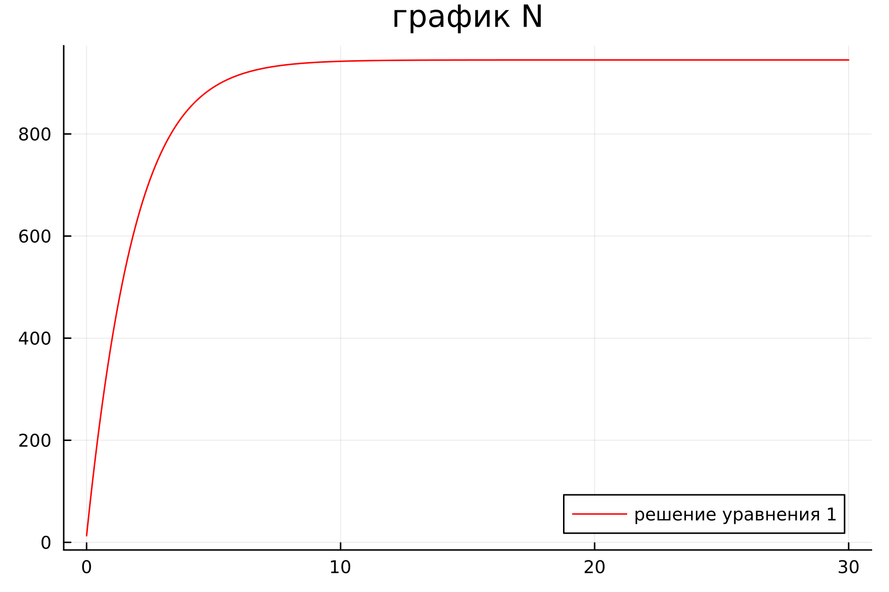
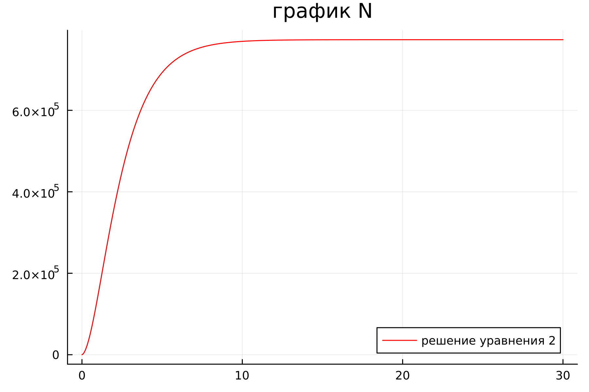
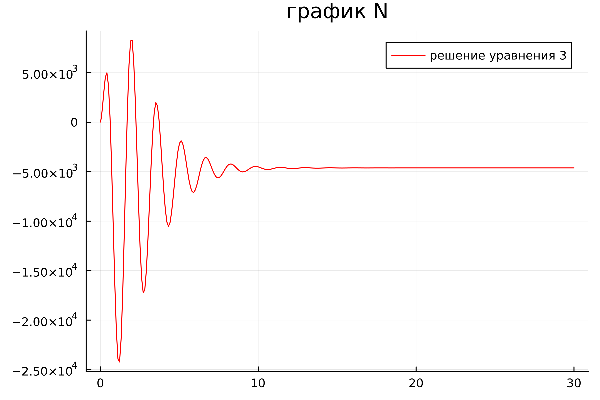
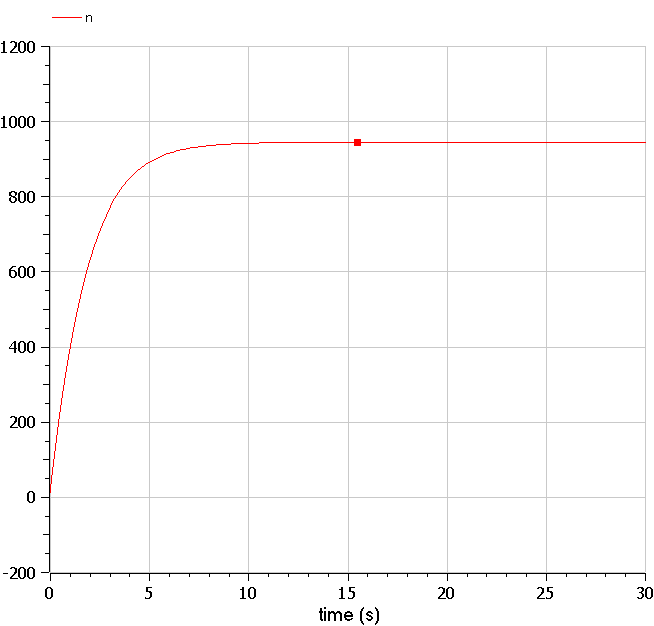
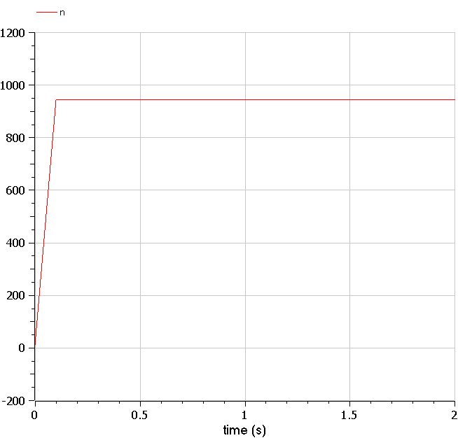
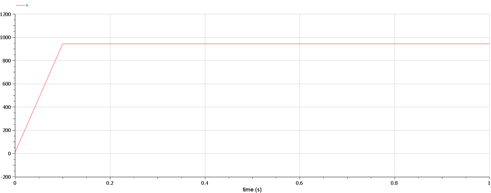

---
## Front matter
title: "Отчёт по лабораторной работе 7"
subtitle: "Простейший вариант 23"
author: "Ду нашсименту Висенте Феликс"

## Generic otions
lang: ru-RU
toc-title: "Содержание"

## Bibliography
bibliography: bib/cite.bib
csl: pandoc/csl/gost-r-7-0-5-2008-numeric.csl

## Pdf output format
toc: true # Table of contents
toc-depth: 2
lof: true # List of figures
lot: true # List of tables
fontsize: 12pt
linestretch: 1.5
papersize: a4
documentclass: scrreprt
## I18n polyglossia
polyglossia-lang:
  name: russian
  options:
	
	- babelshorthands=true
polyglossia-otherlangs:
  name: english
## I18n babel
babel-lang: russian
babel-otherlangs: english
## Fonts
mainfont: PT Serif
romanfont: PT Serif
sansfont: PT Sans
monofont: PT Mono
mainfontoptions: Ligatures=TeX
romanfontoptions: Ligatures=TeX
sansfontoptions: Ligatures=TeX,Scale=MatchLowercase
monofontoptions: Scale=MatchLowercase,Scale=0.9
## Biblatex
biblatex: true
biblio-style: "gost-numeric"
biblatexoptions:
  - parentracker=true
  - backend=biber
  - hyperref=auto
  - language=auto
  - autolang=other*
  - citestyle=gost-numeric
## Pandoc-crossref LaTeX customization
figureTitle: "Рис."
tableTitle: "Таблица"
listingTitle: "Листинг"
lofTitle: "Список иллюстраций"
lotTitle: "Список таблиц"
lolTitle: "Листинги"
## Misc options
indent: true
header-includes:
  - \usepackage{indentfirst}
  - \usepackage{float} # keep figures where there are in the text
  - \floatplacement{figure}{H} # keep figures where there are in the text
---

## Цель работы

 Pешаем Задача об Эффективность рекламы.

## Задание

Формула определения номера задания: (SnmodN)+1, где Sn — номер студбилета, N — количество заданий.

Вариант № 23
Постройте график распространения рекламы, математическая модель которой описывается следующим уравнением:

$$
\frac{dn}{dt}=
\begin{cases}
  (0.51 + 0.000099n(t))(N - n(t))
  \\
  (0.000019 + 0.99n(t))(N - n(t))
  \\
  (0.99t + 0.3cos(4t)n(t))(N - n(t))
\end{cases}
$$
При этом объем аудитории $N = 945$, в начальный момент о товаре знает 13 человек.
Для случая 2 определите в какой момент времени скорость распространения рекламы будет иметь максимальное значение.

## Теоретическое введение

Организуется рекламная кампания нового товара или услуги. Необходимо, чтобы прибыль будущих продаж с избытком покрывала издержки на рекламу.
Вначале расходы могут превышать прибыль, поскольку лишь малая часть
потенциальных покупателей будет информирована о новинке. Затем, при
увеличении числа продаж, возрастает и прибыль, и, наконец, наступит момент, когда рынок насытиться, и рекламировать товар станет бесполезным.
Предположим, что торговыми учреждениями реализуется некоторая продукция, о которой в момент времени t из числа потенциальных покупателей Nзнает лишь n покупателей.
Для ускорения сбыта продукции запускается реклама по радио, телевидению и других средств массовой информации.
После запуска рекламной кампании информация о продукции начнет распространяться среди потенциальных покупателей путем общения друг с другом.
Таким образом, после запуска рекламных объявлений скорость изменения числа знающих о продукции людей пропорциональна как числу знающих о товаре покупателей, так и числу покупателей о нем не знающих
Модель рекламной кампании описывается следующими величинами.
Считаем, что $\frac{dn}{dt}$ скорость изменения со временем числа потребителей, узнавших о товаре и готовых его купить, t - время, прошедшее с начала рекламной кампании, n(t) - число уже информированных клиентов.
Эта величина пропорциональна числу покупателей, еще не знающих о нем, это описывается следующим образом: $\alpha$~1~$(N - n(t)) $, где N - общее число потенциальных платежеспособных покупателей,$\alpha$~1~$(t)>0$ - характеризует интенсивность рекламной кампании (зависит от затрат на рекламу в данный момент времени).
Помимо этого, узнавшие о товаре потребители также распространяют полученную информацию среди потенциальных покупателей, не знающих о нем (в этом случае работает т.н. сарафанное радио).

Этот вклад в рекламу описывается величиной $\alpha$~2~$n(t)(N - n(t)) $, эта величина увеличивается с увеличением потребителей узнавших о товаре. Математическая модель распространения рекламы описывается уравнением:

$\alpha$~1~ = 0.51
$\alpha$~2~ = 0.000099
$$ \frac{dn}{dt} = ( \alpha~1~ + \alpha ~2~ n(t))(N - n(t)) $$

При $\alpha$~1~ $\gg $ $\alpha$~2~ получается модель типа модели Мальтуса, решение которой имеет вид



В обратном случае, при $\alpha$~1~ $\ll $ $\alpha$~2~ получаем уравнение логистической кривой:
$\alpha$~1~ = 0.99
$\alpha$~2~ = 0.000019
$$ \frac{dn}{dt} = ( \alpha~1~ + \alpha ~2~ n(t))(N - n(t)) $$




## Выполнение лабораторной работы

1. julia

```
1.1
using Plots
using DifferentialEquations

"коэффициент уравнения 1"
a1 = 0.51
a2 = 0.000099

"коэффициент уравнения 2"
b1 = 0.000019
b2 = 0.99

"коэффициент уравнения 3"
c1 = 0.99
c2 = 0.3
N = 945    
n0 = 13


function  odn_f(du, u, p, t)
    x, y, z = u
    du[1]= (a1+a2*u[1])*(N-u[1])                 
    du[2]= (b1+b2*u[1])*(N-u[1])                     
    du[3]= (c1*t+c2*cos(4*t)*u[1])*(N-u[1])           
end
u0 = [n0, n0, n0]
tspan =(0.0, 30.0)
prob1 = ODEProblem(odn_f, u0, tspan)
sol1 = solve(prob1, dtmax=0.1)

N1 = [u[1] for u in sol1.u]
N2 = [u[2] for u in sol1.u]
N3 = [u[3] for u in sol1.u]
T = [t for t in sol1.t]

plt = 
    plot(
        layout=(1),
        dpi=300,
        legend=true)
        
    plot!(
        plt[1],
        T,
        N1,
        title="график N",
        label="решение уравнения 1",
        color=:red)
    

        savefig("lab71.png")
```

```
1.2
using Plots
using DifferentialEquations

"коэффициент уравнения 1"
a1 = 0.51
a2 = 0.000099

"коэффициент уравнения 2"
b1 = 0.000019
b2 = 0.99

"коэффициент уравнения 3"
c1 = 0.99
c2 = 0.3
N = 945    
n0 = 13


function  odn_f(du, u, p, t)
    x, y, z = u
    du[1]= (a1+a2*u[1])*(N-u[1])                 
    du[2]= (b1+b2*u[1])*(N-u[1])                     
    du[3]= (c1*t+c2*cos(4*t)*u[1])*(N-u[1])           
end
u0 = [n0, n0, n0]
tspan =(0.0, 30.0)
prob1 = ODEProblem(odn_f, u0, tspan)
sol1 = solve(prob1, dtmax=0.1)

N1 = [u[1] for u in sol1.u]
N2 = [u[2] for u in sol1.u]
N3 = [u[3] for u in sol1.u]
T = [t for t in sol1.t]

plt = 
    plot(
        layout=(1),
        dpi=300,
        legend=true)
        
    plot!(
        plt[1],
        T,
        N2,
        title="график N",
        label="решение уравнения 2",
        color=:red)
    

        savefig("lab72.png")
```

```
1.3)
using Plots
using DifferentialEquations

"коэффициент уравнения 1"
a1 = 0.51
a2 = 0.000099

"коэффициент уравнения 2"
b1 = 0.000019
b2 = 0.99

"коэффициент уравнения 3"
c1 = 0.99
c2 = 0.3
N = 945    
n0 = 13


function  odn_f(du, u, p, t)
    x, y, z = u
    du[1]= (a1+a2*u[1])*(N-u[1])                 
    du[2]= (b1+b2*u[1])*(N-u[1])                     
    du[3]= (c1*t+c2*cos(4*t)*u[1])*(N-u[1])           
end
u0 = [n0, n0, n0]
tspan =(0.0, 30.0)
prob1 = ODEProblem(odn_f, u0, tspan)
sol1 = solve(prob1, dtmax=0.1)

N1 = [u[1] for u in sol1.u]
N2 = [u[2] for u in sol1.u]
N3 = [u[3] for u in sol1.u]
T = [t for t in sol1.t]

plt = 
    plot(
        layout=(1),
        dpi=300,
        legend=true)
        
    plot!(
        plt[1],
        T,
        N3,
        title="график N",
        label="решение уравнения 3",
        color=:red)
    

        savefig("lab73.png")
```

2.OMEDIt
2.1)
```
model lab71
parameter Real N = 945;
parameter Real N0 = 13;
Real n(start = N0);

function f
  input Real t;
  output Real result;
 algorithm
  result:=0.51;
  end f;

function g
  input Real t;
  output Real result;
 algorithm
  result:=0.000099;
  end g;
equation
der(n)=(f(time)+g(time)*n)*(N-n);

annotation(experiment(StartTime = 0, StopTime = 30, Tolerance = 1e-6, Interval = 0.1));

end lab71;
```

2.2)
```
model lab72
parameter Real N = 945;
parameter Real N0 = 13;
Real n(start = N0);

function f
  input Real t;
  output Real result;
 algorithm
  result:=0.000019;
  end f;

function g
  input Real t;
  output Real result;
 algorithm
  result:=0.99;
  end g;
equation

der(n)=(f(time)+g(time)*n)*(N-n);

annotation(experiment(StartTime = 0, StopTime = 2.0, Tolerance = 1e-6, Interval = 0.1));

end lab72;

```

2.3)
```
model lab73

parameter Real N = 945;
parameter Real N0 = 13;
Real n(start = N0);

function f
  input Real t;
  output Real result;
 algorithm
  result:=0.99*t;
  end f;

function g
  input Real t;
  output Real result;
 algorithm
  result:=0.3*cos(4*t);
  end g;

equation

der(n)=(f(time)+g(time)*n)*(N-n);

annotation(experiment(StartTime = 0, StopTime = 1.0, Tolerance = 1e-6, Interval = 0.1));

end lab73;
```
