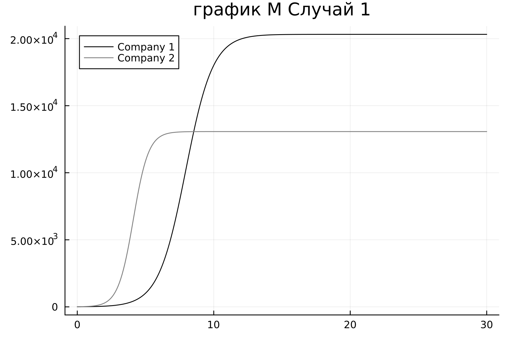

---
## Front matter
lang: ru-RU
title: Презентация к лабораторной работе  8
subtitle: Вариант 23
author:
  - Ду нашсименту Висенте Феликс.
institute:
  - Российский университет дружбы народов, Москва, Россия
  - Факультет физико-математических и естественных наук, Москва, Россия
date: 28 февраля 2023

## i18n babel
babel-lang: russian
babel-otherlangs: english

## Formatting pdf
toc: false
toc-title: Содержание
slide_level: 2
aspectratio: 169
section-titles: true
theme: metropolis
header-includes:
 - \metroset{progressbar=frametitle,sectionpage=progressbar,numbering=fraction}
 - '\makeatletter'
 - '\beamer@ignorenonframefalse'
 - '\makeatother'
---

# Информация

## Докладчик

:::::::::::::: {.columns align=center}
::: {.column width="70%"}

  * Ду нашсименту Висенте Феликс
  * Студент 3-го курса
  * Группа НКНбд-01-20
  * Российский университет дружбы народов
  * 1032199092
  * <https://github.com/kpatocfelix>

# Вводная часть

## Актуальность

Целью работы Являеться построение Модель конкуренции двух фирм

## Цели и задачи

- Научиться работать с OpenModelica и julia

- Рассмотрим простейшую Модель конкуренции двух фирм

- Постройте графики изменения оборотных средств фирмы 1 и фирмы 2 без учета постоянных издержек и с веденной нормировкой для случая 1.

- Постройте графики изменения оборотных средств фирмы 1 и фирмы 2 без учета постоянных издержек и с веденной нормировкой для случая 2

## Первый случай

- Описал систему Ду для Первого случаяб когда конкурентная борьба ведется толко рыночными методами.

function ode_f(du, u, p, t)
    m1, m2 = u
    du[1] = (c1/c1)*u[1]-(a1/c1)*u[1]*u[1]-(b/c1)*u[1]*u[2]
    du[2] = (c2/c1)*u[2]-(a2/c1)*u[2]*u[2]-(b/c1)*u[1]*u[2]
end

## первый случай

- Начальные условия заупустим просчет и сохраним результат в график.

## первый случай

- Первый случай на OMedit, Зададим начальные значения и систему Ду.
  equation
der (M1) = (c1/c1)*M1-(a1/c1)*M1*M1-(b/c1)*M1*M2;
der(M2) = (c2/c1)*M2-(a2/c1)*M2*M2-(b/c1)*M1*M2;

## первый случай

- Начальные условия заупустим просчет и сохраним результат в график.

## Второй случай

- Описал систему Ду для Первого случая, когда конкурентная борьба ведется толко рыночными методами.

function ode_f(du, u, p, t)
    m1, m2 = u
    du[1] = u[1]-((b/c1)+0.00016)*u[1]*u[1]-(a1/c1)*u[1]^2
    du[2] = (c2/c1)*u[2]-(b/c1)*u[1]*u[2]-(a2/c1)*u[2]^2
end

## Второй случай

- Начальные условия заупустим просчет и сохраним результат в график.

## Второй случай

- Начальные условия заупустим просчет и сохраним результат в график.

## Объект и предмет исследования

-	Эффективность Фирмы
-	Язык программирования Julia 
-	Система моделирования Openmodelica

## Спасибо За Внимания
