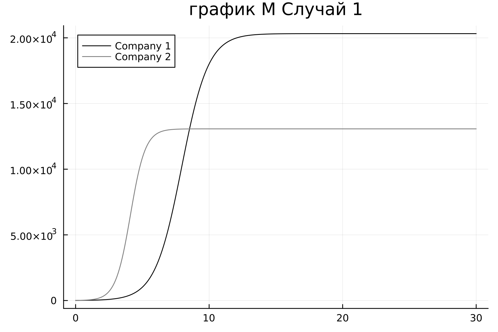
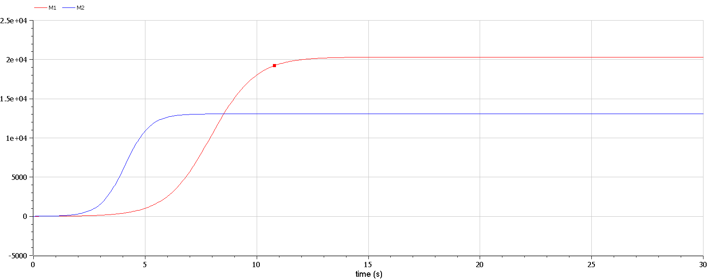
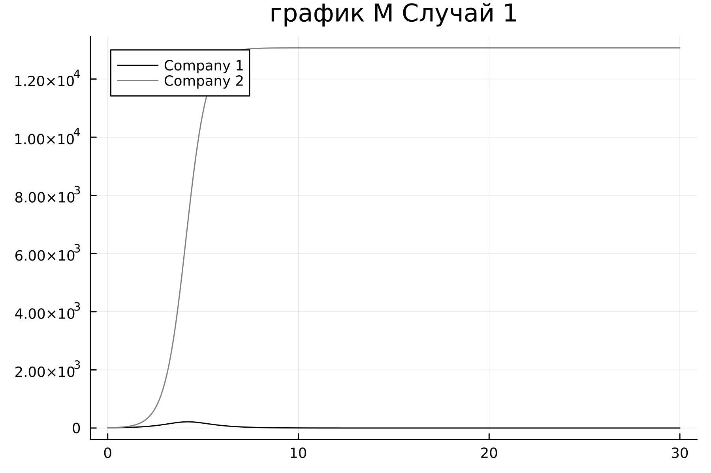

---
## Front matter
title: "Отчёт по лабораторной работе 8"
subtitle: "Простейший вариант 23"
author: "Ду нашсименту Висенте Феликс"

## Generic otions
lang: ru-RU
toc-title: "Содержание"

## Bibliography
bibliography: bib/cite.bib
csl: pandoc/csl/gost-r-7-0-5-2008-numeric.csl

## Pdf output format
toc: true # Table of contents
toc-depth: 2
lof: true # List of figures
lot: true # List of tables
fontsize: 12pt
linestretch: 1.5
papersize: a4
documentclass: scrreprt
## I18n polyglossia
polyglossia-lang:
  name: russian
  options:
	
	- babelshorthands=true
polyglossia-otherlangs:
  name: english
## I18n babel
babel-lang: russian
babel-otherlangs: english
## Fonts
mainfont: PT Serif
romanfont: PT Serif
sansfont: PT Sans
monofont: PT Mono
mainfontoptions: Ligatures=TeX
romanfontoptions: Ligatures=TeX
sansfontoptions: Ligatures=TeX,Scale=MatchLowercase
monofontoptions: Scale=MatchLowercase,Scale=0.9
## Biblatex
biblatex: true
biblio-style: "gost-numeric"
biblatexoptions:
  - parentracker=true
  - backend=biber
  - hyperref=auto
  - language=auto
  - autolang=other*
  - citestyle=gost-numeric
## Pandoc-crossref LaTeX customization
figureTitle: "Рис."
tableTitle: "Таблица"
listingTitle: "Листинг"
lofTitle: "Список иллюстраций"
lotTitle: "Список таблиц"
lolTitle: "Листинги"
## Misc options
indent: true
header-includes:
  - \usepackage{indentfirst}
  - \usepackage{float} # keep figures where there are in the text
  - \floatplacement{figure}{H} # keep figures where there are in the text
---

## Цель работы

 Pешаем Задача об Конкуренция двух фирм.

## Задание

Формула определения номера задания: (SnmodN)+1, где Sn — номер студбилета, N — количество заданий.

Вариант № 23

  1. Постройте графики изменения оборотных средств фирмы 1 и фирмы 2 без учета постоянных издержек и с веденной нормировкой для случая 1.

  2. Постройте графики изменения оборотных средств фирмы 1 и фирмы 2 без учета постоянных издержек и с веденной нормировкой для случая 2.

## Обозначения

N – число потребителей производимого продукта.
$τ$ – длительность производственного цикла
p – рыночная цена товара
p̃– себестоимость продукта, то есть переменные издержки на производство единицы продукции.
q – максимальная потребность одного человека в продукте в единицу времени
$\theta$ = $\frac{1}{c~1~}$ - безразмерное время
  
## Теоретическое введение

### Случай 1

Рассмотрим две фирмы, производящие взаимозаменяемые товары одинакового качества и находящиеся в одной рыночной нише.
Последнее означает, что у потребителей в этой нише нет априорных предпочтений, и они приобретут тот или иной товар, не обращая внимания на знак фирмы.
В этом случае, на рынке устанавливается единая цена, которая определяется балансом суммарного предложения и спроса. Иными словами, в рамках нашей модели конкурентная борьба ведётся только рыночными методами. То есть, конкуренты могут влиять на противника путем изменения параметров своего производства: себестоимость, время цикла, но не могут прямо вмешиваться в ситуацию на рынке («назначать» цену или влиять на потребителей каким либо иным способом.)
Уравнения динамики оборотных средств запишем по аналогии с (2) в виде

$$
\frac{dM ~1~}{dt} = - \frac{M ~1~}{τ~1~}+N~1~ q(1-\frac{p}{p~cr~})p-k~1~
$$

$$
\frac{dM ~2~}{dt} = - \frac{M ~2~}{τ~2~}+N~2~ q(1-\frac{p}{p~cr~})p-k~2~
$$

где использованы те же обозначения, а индексы 1 и 2 относятся к первой и второй фирме, соответственно. Величины N1 и N2 – числа потребителей, приобретших товар первой и второй фирмы. Учтем, что товарный баланс устанавливается быстро, то есть, произведенный каждой фирмой товар не накапливается, а реализуется по цене $p$.
Тогда 
$$\frac{M ~1~}{τ~1~p̃~1~}+N~1~ q(1-\frac{p}{p~cr~})$$, $$\frac{M ~2~}{τ~2~p̃~2~}+N~2~ q(1-\frac{p}{p~cr~})$$
 где p̃~1~ и p̃~2~ – себестоимости товаров в первой и второй фирме.

$$
\frac{dM ~1~}{dt} = - \frac{M ~1~}{τ~1~}(1-\frac{p}{p~cr~})-k~1~
$$

$$
\frac{dM ~2~}{dt} = - \frac{M ~2~}{τ~2~}(1-\frac{p}{p~cr~})-k~2~
$$

Уравнение для цены, по аналогии $\frac{dp}{dt}= -\gamma (\frac{M ~1~}{τ~1~p̃~1~}+\frac{M ~2~}{τ~2~p̃~2~}- Nq(1-\frac{p}{p~cr~}))$, Считая, как и выше, что ценовое равновесие устанавливается быстро, получим:
$$p=p~cr~(1-\frac{p}{p~cr~}(\frac{M ~1~}{τ~1~p̃~1~}+\frac{M ~2~}{τ~2~p̃~2~}))$$
$$\frac{dM~1~}{dt} = c1M1 - bM1M2 - a1M^21-k1$$
$$\frac{dM~2~}{dt} = c2M2 - bM1M2 - a2M^22-k2
$$
где
$a1=\frac{pcr}{\tau^2~1~p^21Nq}$, $a2=\frac{pcr}{\tau^2~2~p^22Nq}$, $b=\frac{pcr}{\tau^2~1~p^21\tau^2~2~p^22Nq}$, $c1=\frac{pcr-\tilde{p}1}{\tau1\tilde{p}1}$, $c2=\frac{pcr-\tilde{p}2}{\tau2\tilde{p}2}$, Исследуем систему  в случае, когда постоянные издержки (κ1, κ2)
пренебрежимо малы. И введем нормировку $t=c1\theta$.
Получим следующую систему:
$$\frac{dM1}{d\theta}= M1-\frac{b}{c1}M1M2-\frac{a2}{c1}M^21 $$
$$\frac{dM2}{d\theta}= \frac{c2}{c1}M2-\frac{b}{c1}M1M2-\frac{a2}{c1}M^22 $$

Чтобы решить систему (17) необходимо знать начальные значения M^1^~0~ = 7.2 M^2^~0~ = 8.2 начальные условия. Зададим известные параметры:
pcr = p_cr = 43
N = 87
q = 1
$\tau 1$ = tau1 = 27
$\tau 2$ = tau2 = 20
p1 = 12
p2 = 9.7
Замечание: Необходимо учесть, что значения p~1,2~,p_cr,$N$ указаны в тысячах единиц (например $N = 87$ - означает 87 000 потенциальных потребителей), а значения M~1,2~ указаны в млн. единиц.
При таких условиях получаем следующие динамики изменения объемов продаж

### Julia 1



#### CODE JULIA 1

```
using Plots
using DifferentialEquations

p_cr = 43 
N = 87 
q = 1 
tau1 = 27 
tau2 = 20
p1 = 12 
p2 = 9.7 
M01 = 7.2
M02 = 8.2

a1 = p_cr/(tau1*tau1*p1*p1*N*q)
a2 = p_cr/(tau2*tau2*p2*p2*N*q)
b = p_cr/(tau1*tau1*tau2*tau2*p1*p1*p2*p2*N*q)
c1 = (p_cr-p1)/(tau1*p1)
c2 = (p_cr-p2)/(tau2*p2)

function ode_f(du, u, p, t)
    m1, m2 = u
    du[1] = (c1/c1)*u[1]-(a1/c1)*u[1]*u[1]-(b/c1)*u[1]*u[2]
    du[2] = (c2/c1)*u[2]-(a2/c1)*u[2]*u[2]-(b/c1)*u[1]*u[2]
end

u0 = [M01, M02]
tspan =(0.0, 30.0)
prob1 = ODEProblem(ode_f, u0, tspan)
sol1 = solve(prob1, dtmax=0.1)

M1 = [u[1] for u in sol1.u]
M2 = [u[2] for u in sol1.u]
T = [t for t in sol1.t]

plt = 
    plot(
        layout=(1),
        dpi=300,
        legend=true)
    plot!(
            plt[1],
            T,
            M1,
            title="график M Случай 1",
            label="Company 1",
            color=:black)
    plot!(
            plt[1],
            T,
            M2,
            label="Company 2",
            color=:gray)
        
        savefig("lab8_1.png")
```

### OMEDIT



#### CODE OMEDIT 1

```

model lab81
Real p_cr = 43; 
Real N = 87;
Real q = 1; 
Real tau1 = 27; 
Real tau2 = 20;
Real p1 = 12;
Real p2 = 9.7; 
Real M1;
Real M2;

Real a1 = p_cr/(tau1*tau1*p1*p1*N*q);
Real a2 = p_cr/(tau2*tau2*p2*p2*N*q);
Real b = p_cr/(tau1*tau1*tau2*tau2*p1*p1*p2*p2*N*q);
Real c1 = (p_cr-p1)/(tau1*p1);
Real c2 = (p_cr-p2)/(tau2*p2);

initial equation
M1 = 7.2;
M2 = 8.2;

equation
der (M1) = (c1/c1)*M1-(a1/c1)*M1*M1-(b/c1)*M1*M2;
der(M2) = (c2/c1)*M2-(a2/c1)*M2*M2-(b/c1)*M1*M2;
annotation(experiment( StartTime = 0, StopTime = 30, Tolerance = 1e-06, interval = 0.05));

end lab81;

```

По графику видно, что рост оборотных средств предприятий идет независимо друг от друга. В математической модели (17) этот факт отражается в коэффициенте, стоящим перед членом M1 M2: в рассматриваемой задаче он одинаковый в обоих уравнениях ($\frac{b}{c1}$).
Это было обозначено в условиях задачи.
Каждая фирма достигает свое максимальное значение объема продаж и остается на рынке с этим значением, то есть каждая фирма захватывает свою часть рынка потребителей, которая не изменяется.

### Случай 2

Рассмотрим модель, когда, помимо экономического фактора влияния (изменение себестоимости, производственного цикла, использование кредита и т.п.), используются еще и социально-психологические факторы – формирование общественного предпочтения одного товара другому, не зависимо от их качества и цены.
В этом случае взаимодействие двух фирм будет зависеть друг от друга, соответственно коэффициент перед M1 M2будет отличаться.
Рассмотрим следующую модель:

$$\frac{dM1}{d\theta}= M1-(\frac{b}{c1}+0.00014)M1M2-\frac{a2}{c1}M^21 $$
$$\frac{dM2}{d\theta}= \frac{c2}{c1}M2-\frac{b}{c1}M1M2-\frac{a2}{c1}M^22 $$
Начальные условия и известные параметры остаются прежними. В этом случаем получим следующее решение

### JULIA 2



#### Code JULIA 2

```

using Plots
using DifferentialEquations

p_cr = 43 
N = 87 
q = 1 
tau1 = 27 
tau2 = 20
p1 = 12 
p2 = 9.7 
M01 = 7.2
M02 = 8.2

a1 = p_cr/(tau1*tau1*p1*p1*N*q)
a2 = p_cr/(tau2*tau2*p2*p2*N*q)
b = p_cr/(tau1*tau1*tau2*tau2*p1*p1*p2*p2*N*q)
c1 = (p_cr-p1)/(tau1*p1)
c2 = (p_cr-p2)/(tau2*p2)

function ode_f(du, u, p, t)
    m1, m2 = u
    du[1] = u[1]-((b/c1)+0.00014)*u[1]*u[2]-(a1/c1)*u[1]^2
    du[2] = (c2/c1)*u[2]-(b/c1)*u[1]*u[2]-(a2/c1)*u[2]^2
end

u0 = [M01, M02]
tspan =(0.0, 30.0)
prob1 = ODEProblem(ode_f, u0, tspan)
sol1 = solve(prob1, dtmax=0.1)

M1 = [u[1] for u in sol1.u]
M2 = [u[2] for u in sol1.u]
T = [t for t in sol1.t]

plt = 
    plot(
        layout=(1),
        dpi=300,
        legend=true)
    plot!(
            plt[1],
            T,
            M1,
            title="график M Случай 1",
            label="Company 1",
            color=:black)
    plot!(
            plt[1],
            T,
            M2,
            label="Company 2",
            color=:gray)
        
        savefig("lab8_2.png")

```

### OMEDIT 2


#### Code OMedit 2

```

model lab82
Real p_cr = 43; 
Real N = 87;
Real q = 1; 
Real tau1 = 27; 
Real tau2 = 20;
Real p1 = 12;
Real p2 = 9.7; 
Real M1;
Real M2;

Real a1 = p_cr/(tau1*tau1*p1*p1*N*q);
Real a2 = p_cr/(tau2*tau2*p2*p2*N*q);
Real b = p_cr/(tau1*tau1*tau2*tau2*p1*p1*p2*p2*N*q);
Real c1 = (p_cr-p1)/(tau1*p1);
Real c2 = (p_cr-p2)/(tau2*p2);

initial equation
M1 = 7.2;
M2 = 8.2;

equation
der (M1) = M1-((b/c1)+0.00014)*M1*M2-(a1/c1)*M1^2;
der(M2) = (c2/c1)*M2-(a2/c1)*M2*M2-(b/c1)*M1*M2;
annotation(experiment( StartTime = 0, StopTime = 30, Tolerance = 1e-06, interval = 0.05));

end lab82;

```

о графику видно, что первая фирма, несмотря на начальный рост, достигнув своего максимального объема продаж, начитает нести убытки и, в итоге, терпит банкротство.
Динамика роста объемов оборотных средств второй фирмы остается без изменения: достигнув максимального значения, остается на этом уровне.
Замечание: Стоит отметить, что рассматривается упрощенная модель, которая дает модельное решение. В реальности факторов, влияющих на динамику изменения оборотных средств предприятий, больше.
