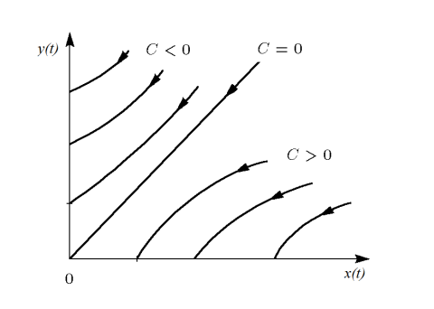
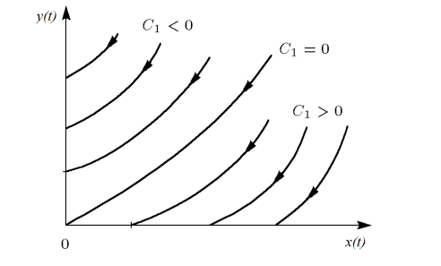
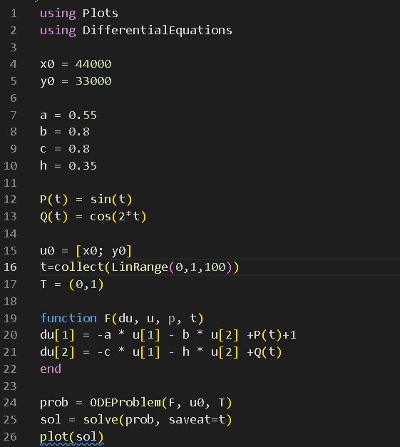
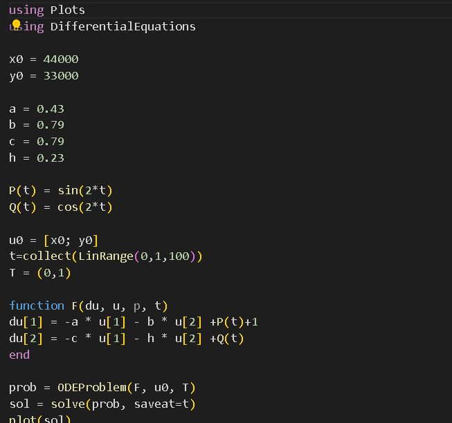
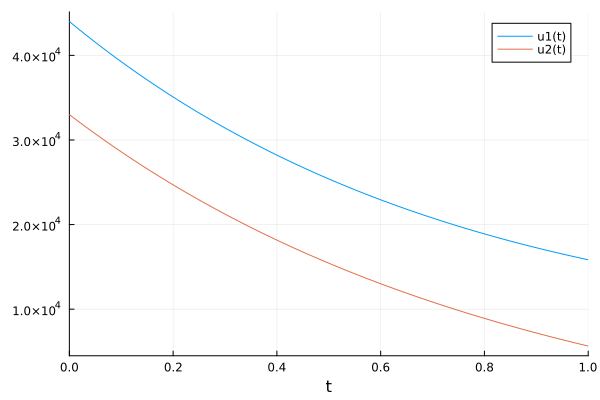
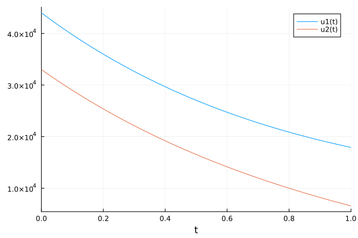

---
## Front matter
title: "Отчёт по лабораторной работе 3"
subtitle: "Простейший вариант 23"
author: "Ду нашсименту Висенте Феликс"

## Generic otions
lang: ru-RU
toc-title: "Содержание"

## Bibliography
bibliography: bib/cite.bib
csl: pandoc/csl/gost-r-7-0-5-2008-numeric.csl

## Pdf output format
toc: true # Table of contents
toc-depth: 2
lof: true # List of figures
lot: true # List of tables
fontsize: 12pt
linestretch: 1.5
papersize: a4
documentclass: scrreprt
## I18n polyglossia
polyglossia-lang:
  name: russian
  options:
	
	- babelshorthands=true
polyglossia-otherlangs:
  name: english
## I18n babel
babel-lang: russian
babel-otherlangs: english
## Fonts
mainfont: PT Serif
romanfont: PT Serif
sansfont: PT Sans
monofont: PT Mono
mainfontoptions: Ligatures=TeX
romanfontoptions: Ligatures=TeX
sansfontoptions: Ligatures=TeX,Scale=MatchLowercase
monofontoptions: Scale=MatchLowercase,Scale=0.9
## Biblatex
biblatex: true
biblio-style: "gost-numeric"
biblatexoptions:
  - parentracker=true
  - backend=biber
  - hyperref=auto
  - language=auto
  - autolang=other*
  - citestyle=gost-numeric
## Pandoc-crossref LaTeX customization
figureTitle: "Рис."
tableTitle: "Таблица"
listingTitle: "Листинг"
lofTitle: "Список иллюстраций"
lotTitle: "Список таблиц"
lolTitle: "Листинги"
## Misc options
indent: true
header-includes:
  - \usepackage{indentfirst}
  - \usepackage{float} # keep figures where there are in the text
  - \floatplacement{figure}{H} # keep figures where there are in the text
---

## Цель работы

 Pешаем задачу о Модель боевых действий.

## Задание

Формула определения номера задания: (SnmodN)+1, где Sn — номер студбилета, N — количество заданий.

Вариант 23
Между страной Х и страной У идет война. Численность состава войск исчисляется от начала войны, и являются временными функциями x(t) и y(t). В начальный момент времени страна Х имеет армию численностью 44 000 человек, а в распоряжении страны У армия численностью в 33 000 человек. Для упрощения модели считаем, что коэффициенты a b c h , , ,
постоянны. Также считаем P(t) и Q (t)
непрерывные функции.
Постройте графики изменения численности войск армии Х и армии У для следующих случаев:
1.1. Модель боевых действий между регулярными войсками

  $$ \frac{dx}{dt}\ = -0,55x(t)-0,8y(t)+sin(t)+1  $$
  
  $$ \frac{dy}{dt}\ = -0,8x(t)-0,35y(t)+cos(2t) $$
2.1. Модель ведение боевых действий с участием регулярных войск и партизанских отрядов

  $$ \frac{dx}{dt}\ = -0,43x(t)-0,79y(t)+sin(2t)+1 $$
  
  $$ \frac{dy}{dt}\ = -0,79x(t)-0,23y(t)+cos(2t) $$

## Теоретическое введение

Рассмотрим некоторые простейшие модели боевых действий – модели Ланчестера. В противоборстве могут принимать участие как регулярные войска,так и партизанские отряды. В общем случае главной характеристикой соперников являются численности сторон. Если в какой-то момент времени одна из численностей обращается в нуль, то данная сторона считается проигравшей (при условии, что численность другой стороны в данный момент положительна).
Рассмотри три случая ведения боевых действий:

  1. Боевые действия между регулярными войсками
  2. Боевые действия с участием регулярных войск и партизанских отрядов
  3. Боевые действия между партизанскими отрядами В первом случае численность регулярных войск определяется тремя факторами:
  
       - скорость уменьшения численности войск из-за причин, не связанных с боевыми действиями (болезни, травмы, дезертирство);
       - скорость потерь, обусловленных боевыми действиями противоборствующих сторон (что связанно с качеством стратегии, уровнем вооружения, профессионализмом солдат и т.п.);
       - скорость поступления подкрепления (задаётся некоторой функцией от времени).

В этом случае модель боевых действий между регулярными войсками описывается следующим образом.

  $$\begin{align}\frac{dx}{dt}\ = -a(t)x(t)-b(t)y(t)+P(t)\end{align} $$
  
  $$\frac{dy}{dt}\ = -c(t)x(t)-h(t)y(t)+Q(t) $$

Потери, не связанные с боевыми действиями, описывают члены -a(t)x(t) и - h(t)y(t), члены -b(t)y(t) и -c(t)x(t) отражают потери на поле боя.
Коэффициенты b(t) и c(t) указывают на эффективность боевых действий со стороны у и х соответственно, a(t), h (t) - величины, характеризующие степень влияния различных факторов на потери. Функции P(t) ,Q(t)  учитывают возможность подхода подкрепления к войскам Х и У в течение одного дня.
Во втором случае в борьбу добавляются партизанские отряды. Нерегулярные войска в отличии от постоянной армии менее уязвимы, так как действуют скрытно, в этом случае сопернику приходится действовать неизбирательно, по площадям, занимаемым партизанами. Поэтому считается, что тем потерь партизан, проводящих свои операции в разных местах на некоторой известной территории, пропорционален не только численности армейских соединений, но и численности самих партизан. В результате модель принимает вид:

  $$\begin{align} \frac{dx}{dt}\ = -a(t)x(t)-b(t)y(t)+P(t) \end{align} $$

  $$\frac{dy}{dt}\ = -h(t)y(t)-c(t)x(t)y(t)+Q(t) $$
  
В этой системе все величины имею тот же смысл, что и в системе (1).
Модель ведение боевых действий между партизанскими отрядами с учетом предположений, сделанном в предыдущем случаем, имеет вид:

 $$\begin{align}\frac{dx}{dt}\ = -a(t)x(t)-b(t)y(t)+P(t)\end{align} $$
  
$$\frac{dy}{dt}\ = -c(t)x(t)-h(t)y(t)+Q(t) $$

В простейшей модели борьбы двух противников коэффициенты b(t) и c(t)
являются постоянными. Попросту говоря, предполагается, что каждый солдат армии x убивает за единицу времени c солдат армии y (и, соответственно, каждый солдат армии y убивает b солдат армии x). Также не учитываются потери, не связанные с боевыми действиями, и возможность подхода подкрепления. Состояние системы описывается точкой (x,y) положительного квадранта плоскости. Координаты этой точки, x и y - это численности противостоящих армий. Тогда модель принимает вид:
$$
\begin{align}
\frac{dx}{dy} =  \frac{by}{cx}
\end{align}
$$
 cxdx = bydy , cx^2^- b^y^ = C

 Эволюция численностей армий x и y происходит вдоль гиперболы, заданной этим уравнением (рис. 4.1). По какой именно гиперболе пойдет война, зависит от начальной точки.

{Рисунок 4.1. Жесткая модель войны}

Эти гиперболы разделены прямой cx^1/2^ = by^1/2^ . Если начальная точка лежит выше этой прямой, то гипербола выходит на ось y. Это значит, что в ходе войны численность армии x уменьшается до нуля (за конечное время). Армия y
выигрывает, противник уничтожен.
Если начальная точка лежит ниже, то выигрывает армия x. В разделяющем эти случаи состоянии (на прямой) война заканчивается истреблением обеих армий. Но на это требуется бесконечно большое время: конфликт продолжает тлеть, когда оба противника уже обессилены.
Вывод модели таков: для борьбы с вдвое более многочисленным противником нужно в четыре раза более мощное оружие, с втрое более многочисленным - в девять раз и т. д. (на это указывают квадратные корни в уравнении прямой).
Стоит помнить, что эта модель сильно идеализирована и неприменима к реальной ситуации. Но может использоваться для начального анализа. Если рассматривать второй случай (война между регулярными войсками и партизанскими отрядами) с теми же упрощениями,то модель (2) принимает вид:

$$
\begin{align}
\frac{dx}{dt} =  by(t)
\end{align}
$$

$$ \frac{dy}{dt} =  cx(t)y(t) $$

Эта система приводится к уравнению

$$
\begin{align}
\frac{d}{dt} (\frac{b}{2} x{^2}(t)-cy(t)) = 0
\end{align}
$$
которое при заданных начальных условиях имеет единственное решение:

$$
\begin{align}
\frac{b}{2} x{^2}(t)-cy(t) =  \frac{b}{2} x{^2}(0)-cy(0)= C~1~
\end{align}
$$

 Рисунок 4.2. Фазовые траектории системы (5)

Из рис. 4.2 видно, что при C~1~>0 побеждает регулярная армия, при С~1~<0
побеждают партизаны. Аналогично противоборству регулярных войск, победа обеспечивается не только начальной численностью, но и боевой выучкой и качеством вооружения. При C~1~>0
получаем соотношение ${\frac{b}{2}}x{^2}(0)>cy(0)$. Чтобы одержать победу партизанам необходимо увеличить коэффициент c и повысить свою начальную численность на соответствующую величину. Причем это увеличение, с ростом начальной численности регулярных войск (x(0)), должно расти не линейно, а пропорционально второй степени x(0). Таким образом, можно сделать вывод, что регулярные войска находятся в более выгодном положении, так как неравенство для них выполняется прим меньшем росте начальной численности войск.
Рассмотренные простейшие модели соперничества соответствуют системам обыкновенных дифференциальных уравнений второго порядка, широко распространенным при описании многих естественно научных объектов.

## Выполнение лабораторной работы

**1.1)** Модель боевых действий между регулярными войсками.
Зададим коэффициент смертности, не связанный с боевыми действиями у первой армии 0,55, у второй 0,35. Коэффициенты эффективности первой и второй армии 0,8 и 0,8 соответственно. Функция, описывающая подход подкрепление первой армии, P(t)= sint+1, подкрепление второй армии описывается функцией Q(t)=cos2t. Тогда получим следующую систему, описывающую противостояние между регулярными войсками X и Y:

  $$ \frac{dx}{dt}\ = -0,55x(t)-0,8y(t)+sin(t)+1 $$
  
  $$ \frac{dy}{dt}\ = -0,8x(t)-0,35y(t)+cos(2t) $$
Построим численное решение задачи.
Код в julia

{img:4}

**1.2)** Модель боевых действий между регулярными войсками.
Зададим коэффициент смертности, не связанный с боевыми действиями у первой армии 0,43, у второй 0,23. Коэффициенты эффективности первой и второй армии 0,79 и 0,79 соответственно. Функция, описывающая подход подкрепление первой армии, P(t)= sint+1, подкрепление второй армии описывается функцией Q(t)=cos2t. Тогда получим следующую систему, описывающую противостояние между регулярными войсками X и Y:

$$ \frac{dx}{dt}\ = -0,43x(t)-0,79y(t)+sin(2t)+1 $$
  
  $$ \frac{dy}{dt}\ = -0,79x(t)-0,23y(t)+cos(2t) $$

{img:5}

## Выводы

## 1.1)

{Выводы от img:4}

{Выводы от img:5}

Как мы видим на графике, чем больше времени проходит, тем больше падение.
